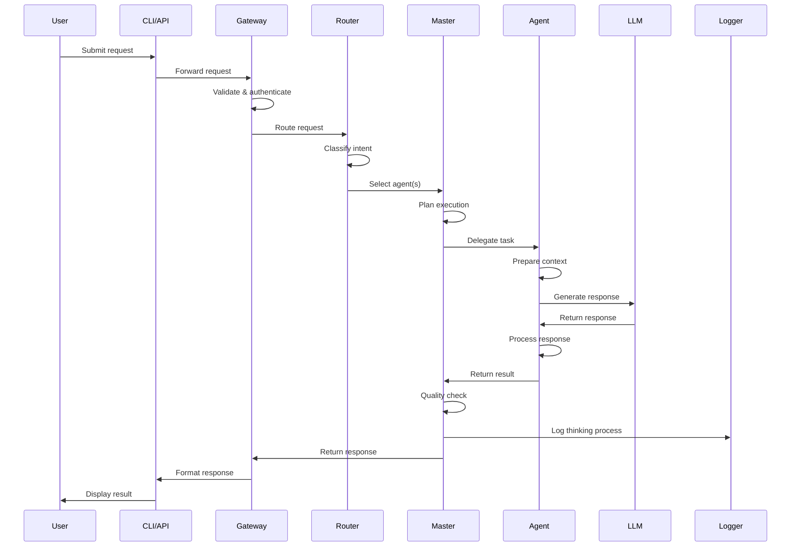
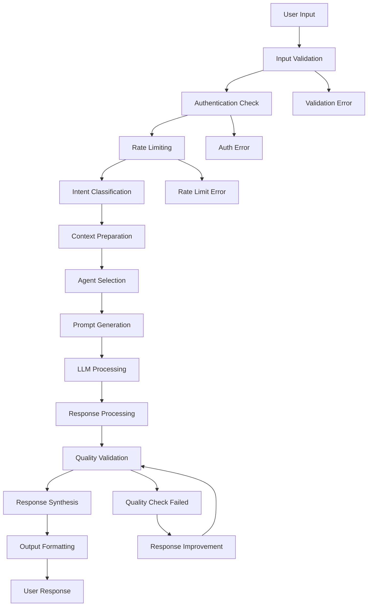

# System Design Document

## Humanified Agentic AI Assistant for Learning & Developer Productivity

**Project:** AWS AI for Bharat Hackathon - Student Track  
**Version:** 1.0  
**Date:** February 5, 2026  
**Document Type:** System Design Document

---

## Table of Contents

1. [Executive Summary](#executive-summary)
2. [High-Level Architecture](#high-level-architecture)
3. [Component Breakdown](#component-breakdown)
4. [Agent Coordination Flow](#agent-coordination-flow)
5. [Data Flow](#data-flow)
6. [Technology Stack](#technology-stack)
7. [Scalability & Extensibility](#scalability--extensibility)
8. [Ethical AI & Safety Design](#ethical-ai--safety-design)
9. [Deployment Overview](#deployment-overview)
10. [Future Enhancements](#future-enhancements)

---

## 1. Executive Summary

### 1.1 System Overview
The Humanified Agentic AI Assistant is a modular, agent-based AI system designed to enhance learning and developer productivity through ethical, explainable AI interactions. The system employs a Master Agent orchestrating 13 specialized agents, each with dedicated roles and prompt templates.

### 1.2 Key Design Principles
- **Educational First**: Prioritize learning over quick solutions
- **Ethical AI**: Built-in guardrails and ethical decision-making
- **Explainable**: Every response includes reasoning and educational context
- **Modular**: Extensible architecture for easy agent addition/modification
- **Scalable**: Cloud-ready design for high availability and performance

### 1.3 Target Architecture
- Agent-based modular AI architecture with FastAPI backend
- CLI and API-based user interaction
- Comprehensive logging and thinking trace layer
- Cloud-native deployment on AWS infrastructure

---

## 2. High-Level Architecture

### 2.1 System Architecture Diagram

```
┌─────────────────────────────────────────────────────────────────┐
│                        USER INTERFACES                          │
├─────────────────────────┬───────────────────────────────────────┤
│      CLI Interface      │           API Interface               │
│   - Command execution   │      - RESTful endpoints             │
│   - Batch processing    │      - WebSocket support             │
│   - IDE integration     │      - Authentication                │
└─────────────────────────┴───────────────────────────────────────┘
                                    │
┌─────────────────────────────────────────────────────────────────┐
│                      API GATEWAY (FastAPI)                      │
├─────────────────────────────────────────────────────────────────┤
│  - Request validation    - Rate limiting    - Authentication    │
│  - Response formatting  - Error handling   - API documentation │
└─────────────────────────────────────────────────────────────────┘
                                    │
┌─────────────────────────────────────────────────────────────────┐
│                    MIDDLEWARE LAYER                             │
├─────────────────────────────────────────────────────────────────┤
│  - Security middleware  - Logging middleware  - Routing logic   │
│  - Request preprocessing - Response postprocessing             │
└─────────────────────────────────────────────────────────────────┘
                                    │
┌─────────────────────────────────────────────────────────────────┐
│                      AGENT ROUTER                               │
├─────────────────────────────────────────────────────────────────┤
│  - Intent classification - Agent selection - Load balancing    │
│  - Context management   - Session handling                     │
└─────────────────────────────────────────────────────────────────┘
                                    │
┌─────────────────────────────────────────────────────────────────┐
│                      MASTER AGENT                               │
├─────────────────────────────────────────────────────────────────┤
│  - Orchestration logic  - Decision making  - Quality control   │
│  - Multi-agent coordination - Response synthesis              │
└─────────────────────────────────────────────────────────────────┘
                                    │
┌─────────────────────────────────────────────────────────────────┐
│                  SPECIALIZED AGENT POOL                         │
├─────────────────────────────────────────────────────────────────┤
│  SQL Agent    │ Code Review │ Debugging   │ Testing    │ Optim. │
│  Explanation  │ Conversion  │ Security    │ Refactor   │ Docs   │
│  Learning     │ Ethics      │ Performance │             │        │
└─────────────────────────────────────────────────────────────────┘
                                    │
┌─────────────────────────────────────────────────────────────────┐
│                 PROMPT TEMPLATE ENGINE                          │
├─────────────────────────────────────────────────────────────────┤
│  - Template management  - Dynamic generation - Version control │
│  - Context injection    - Personalization                      │
└─────────────────────────────────────────────────────────────────┘
                                    │
┌─────────────────────────────────────────────────────────────────┐
│                      LLM HANDLER                                │
├─────────────────────────────────────────────────────────────────┤
│  - Multi-provider support - Response caching - Error handling  │
│  - Token management     - Model selection                      │
└─────────────────────────────────────────────────────────────────┘
                                    │
┌─────────────────────────────────────────────────────────────────┐
│              LOGGING & THINKING TRACE LAYER                     │
├─────────────────────────────────────────────────────────────────┤
│  - Comprehensive logging - Performance metrics - Audit trails  │
│  - Thinking process capture - Analytics data collection        │
└─────────────────────────────────────────────────────────────────┘
```

### 2.2 Architecture Layers

#### 2.2.1 Presentation Layer
- **CLI Interface**: Command-line tool for developer workflows
- **API Interface**: RESTful APIs for integration and web interfaces

#### 2.2.2 Application Layer
- **API Gateway**: Request handling, validation, and routing
- **Middleware**: Cross-cutting concerns (security, logging, monitoring)
- **Agent Router**: Intelligent routing to appropriate agents

#### 2.2.3 Business Logic Layer
- **Master Agent**: Orchestration and decision-making
- **Specialized Agents**: Domain-specific AI agents
- **Prompt Template Engine**: Standardized prompt management

#### 2.2.4 Infrastructure Layer
- **LLM Handler**: AI model integration and management
- **Logging System**: Comprehensive monitoring and analytics
- **Data Storage**: Session management and caching
---

## 3. Component Breakdown

### 3.1 User Interface Components

#### 3.1.1 CLI Interface
```python
# CLI Architecture
cli/
├── commands/
│   ├── analyze.py      # Code analysis commands
│   ├── debug.py        # Debugging assistance
│   ├── explain.py      # Code explanation
│   ├── optimize.py     # Performance optimization
│   └── test.py         # Test generation
├── config/
│   ├── settings.py     # User preferences
│   └── profiles.py     # User skill profiles
└── utils/
    ├── formatters.py   # Output formatting
    └── validators.py   # Input validation
```

**Key Features:**
- Interactive command-line interface with rich formatting
- Batch processing capabilities for multiple files
- Integration with popular IDEs (VS Code, PyCharm, Vim)
- Configuration management for user preferences
- Progress indicators for long-running operations

#### 3.1.2 API Interface
```python
# API Structure
api/
├── endpoints/
│   ├── agents.py       # Agent-specific endpoints
│   ├── analysis.py     # Code analysis endpoints
│   ├── auth.py         # Authentication endpoints
│   └── health.py       # Health check endpoints
├── models/
│   ├── requests.py     # Request schemas
│   ├── responses.py    # Response schemas
│   └── errors.py       # Error models
└── middleware/
    ├── auth.py         # Authentication middleware
    ├── rate_limit.py   # Rate limiting
    └── logging.py      # Request logging
```

**Key Features:**
- RESTful API design with OpenAPI/Swagger documentation
- WebSocket support for real-time interactions
- JWT-based authentication and authorization
- Rate limiting and quota management
- Comprehensive error handling and status codes

### 3.2 Core System Components

#### 3.2.1 API Gateway (FastAPI)
```python
# FastAPI Application Structure
app/
├── main.py             # Application entry point
├── dependencies.py     # Dependency injection
├── middleware/
│   ├── security.py     # Security middleware
│   ├── cors.py         # CORS handling
│   └── monitoring.py   # Performance monitoring
├── routers/
│   ├── agents.py       # Agent routing
│   ├── analysis.py     # Analysis endpoints
│   └── admin.py        # Admin endpoints
└── config/
    ├── settings.py     # Application settings
    └── database.py     # Database configuration
```

**Responsibilities:**
- Request validation and sanitization
- Response formatting and serialization
- Authentication and authorization
- Rate limiting and throttling
- API documentation generation
- Error handling and logging

#### 3.2.2 Agent Router
```python
# Agent Router Implementation
class AgentRouter:
    def __init__(self):
        self.intent_classifier = IntentClassifier()
        self.agent_registry = AgentRegistry()
        self.load_balancer = LoadBalancer()
    
    async def route_request(self, request: UserRequest) -> Agent:
        # Intent classification
        intent = await self.intent_classifier.classify(request.content)
        
        # Agent selection
        candidate_agents = self.agent_registry.get_agents_for_intent(intent)
        
        # Load balancing
        selected_agent = self.load_balancer.select_agent(candidate_agents)
        
        return selected_agent
```

**Key Features:**
- Intent classification using NLP models
- Dynamic agent selection based on request context
- Load balancing across agent instances
- Session management and context preservation
- Fallback mechanisms for agent failures

#### 3.2.3 Master Agent
```python
# Master Agent Architecture
class MasterAgent:
    def __init__(self):
        self.orchestrator = AgentOrchestrator()
        self.quality_controller = QualityController()
        self.response_synthesizer = ResponseSynthesizer()
    
    async def process_request(self, request: UserRequest) -> Response:
        # Multi-agent coordination
        agent_responses = await self.orchestrator.coordinate_agents(request)
        
        # Quality control
        validated_responses = self.quality_controller.validate(agent_responses)
        
        # Response synthesis
        final_response = self.response_synthesizer.synthesize(validated_responses)
        
        return final_response
```

**Responsibilities:**
- Orchestrate multiple specialized agents
- Make high-level decisions about response strategy
- Ensure response quality and consistency
- Handle complex multi-step workflows
- Manage agent dependencies and interactions

### 3.3 Specialized Agent Pool

#### 3.3.1 Agent Base Class
```python
# Base Agent Implementation
class BaseAgent:
    def __init__(self, name: str, prompt_template: str):
        self.name = name
        self.prompt_template = prompt_template
        self.llm_handler = LLMHandler()
        self.context_manager = ContextManager()
    
    async def process(self, request: AgentRequest) -> AgentResponse:
        # Context preparation
        context = self.context_manager.prepare_context(request)
        
        # Prompt generation
        prompt = self.generate_prompt(context)
        
        # LLM interaction
        response = await self.llm_handler.generate(prompt)
        
        # Response processing
        processed_response = self.process_response(response)
        
        return processed_response
    
    def generate_prompt(self, context: dict) -> str:
        return self.prompt_template.format(**context)
    
    def process_response(self, response: str) -> AgentResponse:
        # Agent-specific response processing
        pass
```

#### 3.3.2 Specialized Agents

**SQL Agent**
```python
class SQLAgent(BaseAgent):
    def __init__(self):
        super().__init__(
            name="SQL Agent",
            prompt_template="""
            You are an expert SQL developer and teacher. Your role is to:
            1. Generate optimized SQL queries
            2. Explain query logic step-by-step
            3. Identify performance issues
            4. Suggest improvements
            
            User Request: {user_request}
            Database Schema: {schema}
            Performance Requirements: {performance_req}
            
            Provide your response in the following format:
            - SQL Query with explanations
            - Performance analysis
            - Optimization suggestions
            - Learning points
            """
        )
    
    def process_response(self, response: str) -> AgentResponse:
        # Parse SQL query, explanations, and optimizations
        return SQLAgentResponse(
            query=self.extract_query(response),
            explanation=self.extract_explanation(response),
            optimizations=self.extract_optimizations(response)
        )
```

**Code Review Agent**
```python
class CodeReviewAgent(BaseAgent):
    def __init__(self):
        super().__init__(
            name="Code Review Agent",
            prompt_template="""
            You are a senior software engineer conducting a thorough code review.
            Focus on:
            1. Code quality and maintainability
            2. Security vulnerabilities
            3. Performance issues
            4. Best practices adherence
            
            Code to Review: {code}
            Language: {language}
            Context: {context}
            
            Provide detailed feedback with:
            - Issues categorized by severity
            - Specific line-by-line comments
            - Improvement suggestions
            - Educational explanations
            """
        )
    
    def process_response(self, response: str) -> AgentResponse:
        return CodeReviewResponse(
            issues=self.extract_issues(response),
            suggestions=self.extract_suggestions(response),
            score=self.calculate_quality_score(response)
        )
```

**Debugging Agent**
```python
class DebuggingAgent(BaseAgent):
    def __init__(self):
        super().__init__(
            name="Debugging Agent",
            prompt_template="""
            You are an expert debugger helping developers identify and fix issues.
            
            Error Information: {error_info}
            Code Context: {code_context}
            Stack Trace: {stack_trace}
            
            Provide:
            1. Root cause analysis
            2. Step-by-step debugging approach
            3. Fix recommendations
            4. Prevention strategies
            5. Test cases to verify the fix
            """
        )
```

### 3.4 Supporting Components

#### 3.4.1 Prompt Template Engine
```python
class PromptTemplateEngine:
    def __init__(self):
        self.template_registry = TemplateRegistry()
        self.context_injector = ContextInjector()
        self.personalizer = Personalizer()
    
    def generate_prompt(self, agent_name: str, context: dict, user_profile: UserProfile) -> str:
        # Get base template
        template = self.template_registry.get_template(agent_name)
        
        # Inject context
        contextualized_template = self.context_injector.inject(template, context)
        
        # Personalize for user
        personalized_prompt = self.personalizer.personalize(
            contextualized_template, 
            user_profile
        )
        
        return personalized_prompt
```

#### 3.4.2 LLM Handler
```python
class LLMHandler:
    def __init__(self):
        self.providers = {
            'openai': OpenAIProvider(),
            'anthropic': AnthropicProvider(),
            'aws_bedrock': BedrockProvider()
        }
        self.cache = ResponseCache()
        self.token_manager = TokenManager()
    
    async def generate(self, prompt: str, model_config: ModelConfig) -> str:
        # Check cache first
        cached_response = self.cache.get(prompt)
        if cached_response:
            return cached_response
        
        # Select provider and model
        provider = self.providers[model_config.provider]
        
        # Generate response
        response = await provider.generate(prompt, model_config)
        
        # Cache response
        self.cache.set(prompt, response)
        
        return response
```

#### 3.4.3 Logging and Thinking Trace Layer
```python
class ThinkingTraceLogger:
    def __init__(self):
        self.logger = structlog.get_logger()
        self.metrics_collector = MetricsCollector()
    
    def log_thinking_process(self, agent_name: str, thinking_steps: List[str]):
        self.logger.info(
            "agent_thinking_process",
            agent=agent_name,
            steps=thinking_steps,
            timestamp=datetime.utcnow()
        )
    
    def log_decision_point(self, decision: str, reasoning: str, confidence: float):
        self.logger.info(
            "decision_point",
            decision=decision,
            reasoning=reasoning,
            confidence=confidence
        )
    
    def collect_performance_metrics(self, operation: str, duration: float, success: bool):
        self.metrics_collector.record(
            metric_name=f"{operation}_duration",
            value=duration,
            tags={"success": success}
        )
```
---

## 4. Agent Coordination Flow

### 4.1 Request Processing Workflow



### 4.2 Multi-Agent Coordination

#### 4.2.1 Sequential Processing
```python
class SequentialCoordinator:
    async def coordinate(self, request: UserRequest) -> Response:
        results = []
        
        # Step 1: Code Analysis
        analysis_result = await self.code_review_agent.process(request)
        results.append(analysis_result)
        
        # Step 2: Issue Identification (based on analysis)
        if analysis_result.has_issues():
            debug_request = self.create_debug_request(analysis_result.issues)
            debug_result = await self.debugging_agent.process(debug_request)
            results.append(debug_result)
        
        # Step 3: Optimization (if needed)
        if analysis_result.needs_optimization():
            opt_request = self.create_optimization_request(analysis_result)
            opt_result = await self.optimization_agent.process(opt_request)
            results.append(opt_result)
        
        return self.synthesize_results(results)
```

#### 4.2.2 Parallel Processing
```python
class ParallelCoordinator:
    async def coordinate(self, request: UserRequest) -> Response:
        # Create tasks for parallel execution
        tasks = [
            self.code_review_agent.process(request),
            self.security_agent.process(request),
            self.performance_agent.process(request)
        ]
        
        # Execute in parallel
        results = await asyncio.gather(*tasks, return_exceptions=True)
        
        # Handle exceptions and merge results
        valid_results = [r for r in results if not isinstance(r, Exception)]
        
        return self.merge_parallel_results(valid_results)
```

#### 4.2.3 Conditional Processing
```python
class ConditionalCoordinator:
    async def coordinate(self, request: UserRequest) -> Response:
        # Initial assessment
        intent = await self.classify_intent(request)
        
        if intent == "code_review":
            return await self.handle_code_review(request)
        elif intent == "debugging":
            return await self.handle_debugging(request)
        elif intent == "learning":
            return await self.handle_learning(request)
        else:
            return await self.handle_general_query(request)
    
    async def handle_code_review(self, request: UserRequest) -> Response:
        # Multi-step code review process
        review_result = await self.code_review_agent.process(request)
        
        if review_result.severity_level >= SeverityLevel.HIGH:
            # Get detailed debugging assistance
            debug_result = await self.debugging_agent.process(request)
            review_result.add_debugging_info(debug_result)
        
        if review_result.has_security_issues():
            # Security-focused analysis
            security_result = await self.security_agent.process(request)
            review_result.add_security_analysis(security_result)
        
        return review_result
```

### 4.3 Decision Making Process

#### 4.3.1 Master Agent Decision Tree
```python
class MasterAgentDecisionEngine:
    def __init__(self):
        self.decision_tree = DecisionTree()
        self.confidence_threshold = 0.8
    
    async def make_decision(self, request: UserRequest) -> AgentSelectionDecision:
        # Analyze request complexity
        complexity = self.analyze_complexity(request)
        
        # Determine required expertise
        required_skills = self.identify_required_skills(request)
        
        # Check user skill level
        user_level = self.get_user_skill_level(request.user_id)
        
        # Make agent selection decision
        if complexity == ComplexityLevel.HIGH:
            return self.select_multiple_agents(required_skills)
        elif user_level == SkillLevel.BEGINNER:
            return self.select_educational_agents(required_skills)
        else:
            return self.select_single_agent(required_skills[0])
    
    def analyze_complexity(self, request: UserRequest) -> ComplexityLevel:
        factors = {
            'code_length': len(request.code) if request.code else 0,
            'error_count': len(request.errors) if request.errors else 0,
            'domain_count': len(self.identify_domains(request)),
            'user_questions': len(request.questions) if request.questions else 0
        }
        
        complexity_score = self.calculate_complexity_score(factors)
        
        if complexity_score > 0.8:
            return ComplexityLevel.HIGH
        elif complexity_score > 0.5:
            return ComplexityLevel.MEDIUM
        else:
            return ComplexityLevel.LOW
```

### 4.4 Quality Control and Validation

#### 4.4.1 Response Quality Controller
```python
class ResponseQualityController:
    def __init__(self):
        self.validators = [
            AccuracyValidator(),
            CompletenessValidator(),
            ClarityValidator(),
            EthicalValidator()
        ]
    
    async def validate_response(self, response: AgentResponse) -> ValidationResult:
        validation_results = []
        
        for validator in self.validators:
            result = await validator.validate(response)
            validation_results.append(result)
        
        overall_score = self.calculate_overall_score(validation_results)
        
        if overall_score < self.minimum_quality_threshold:
            return ValidationResult(
                passed=False,
                score=overall_score,
                issues=self.extract_issues(validation_results),
                recommendations=self.generate_recommendations(validation_results)
            )
        
        return ValidationResult(passed=True, score=overall_score)
    
    async def improve_response(self, response: AgentResponse, validation_result: ValidationResult) -> AgentResponse:
        # Use improvement strategies based on validation issues
        improved_response = response
        
        for issue in validation_result.issues:
            if issue.type == IssueType.CLARITY:
                improved_response = await self.improve_clarity(improved_response)
            elif issue.type == IssueType.COMPLETENESS:
                improved_response = await self.add_missing_information(improved_response)
            elif issue.type == IssueType.ACCURACY:
                improved_response = await self.correct_inaccuracies(improved_response)
        
        return improved_response
```

### 4.5 Context Management

#### 4.5.1 Session Context Manager
```python
class SessionContextManager:
    def __init__(self):
        self.context_store = ContextStore()
        self.context_analyzer = ContextAnalyzer()
    
    async def prepare_context(self, request: UserRequest) -> ProcessingContext:
        # Get user session context
        session_context = await self.context_store.get_session_context(request.session_id)
        
        # Analyze current request context
        request_context = self.context_analyzer.analyze_request(request)
        
        # Merge contexts
        merged_context = self.merge_contexts(session_context, request_context)
        
        # Add relevant historical context
        historical_context = await self.get_relevant_history(request, merged_context)
        
        return ProcessingContext(
            session=session_context,
            request=request_context,
            historical=historical_context,
            merged=merged_context
        )
    
    def merge_contexts(self, session_context: dict, request_context: dict) -> dict:
        # Intelligent context merging with conflict resolution
        merged = session_context.copy()
        
        for key, value in request_context.items():
            if key in merged:
                # Resolve conflicts based on recency and relevance
                merged[key] = self.resolve_context_conflict(merged[key], value)
            else:
                merged[key] = value
        
        return merged
```

---

## 5. Data Flow

### 5.1 Request Data Flow



### 5.2 Data Models

#### 5.2.1 Request Models
```python
from pydantic import BaseModel, Field
from typing import Optional, List, Dict, Any
from enum import Enum

class RequestType(str, Enum):
    CODE_REVIEW = "code_review"
    DEBUGGING = "debugging"
    EXPLANATION = "explanation"
    OPTIMIZATION = "optimization"
    TESTING = "testing"
    CONVERSION = "conversion"

class UserRequest(BaseModel):
    session_id: str = Field(..., description="Unique session identifier")
    user_id: str = Field(..., description="User identifier")
    request_type: RequestType = Field(..., description="Type of request")
    content: str = Field(..., description="Main request content")
    code: Optional[str] = Field(None, description="Code to analyze")
    language: Optional[str] = Field(None, description="Programming language")
    context: Optional[Dict[str, Any]] = Field(None, description="Additional context")
    user_level: Optional[str] = Field("intermediate", description="User skill level")
    preferences: Optional[Dict[str, Any]] = Field(None, description="User preferences")

class AgentRequest(BaseModel):
    original_request: UserRequest
    agent_context: Dict[str, Any]
    processing_instructions: Dict[str, Any]
    quality_requirements: Dict[str, Any]
```

#### 5.2.2 Response Models
```python
class AgentResponse(BaseModel):
    agent_name: str = Field(..., description="Name of the responding agent")
    response_type: str = Field(..., description="Type of response")
    content: str = Field(..., description="Main response content")
    explanation: Optional[str] = Field(None, description="Detailed explanation")
    code_snippets: Optional[List[str]] = Field(None, description="Code examples")
    suggestions: Optional[List[str]] = Field(None, description="Improvement suggestions")
    confidence_score: float = Field(..., description="Confidence in response")
    thinking_process: Optional[List[str]] = Field(None, description="Reasoning steps")
    metadata: Optional[Dict[str, Any]] = Field(None, description="Additional metadata")

class SystemResponse(BaseModel):
    request_id: str = Field(..., description="Unique request identifier")
    agent_responses: List[AgentResponse] = Field(..., description="Individual agent responses")
    synthesized_response: str = Field(..., description="Final synthesized response")
    quality_score: float = Field(..., description="Overall quality score")
    processing_time: float = Field(..., description="Total processing time")
    tokens_used: int = Field(..., description="Total tokens consumed")
    learning_points: Optional[List[str]] = Field(None, description="Key learning points")
    next_steps: Optional[List[str]] = Field(None, description="Suggested next steps")
```

### 5.3 Data Storage Strategy

#### 5.3.1 Session Data
```python
class SessionData:
    """Temporary session data stored in Redis"""
    session_id: str
    user_context: Dict[str, Any]
    conversation_history: List[Dict[str, Any]]
    user_preferences: Dict[str, Any]
    skill_assessment: Dict[str, float]
    
    # TTL: 24 hours
    ttl: int = 86400
```

#### 5.3.2 Analytics Data
```python
class AnalyticsData:
    """Long-term analytics data stored in DynamoDB"""
    user_id: str
    request_timestamp: datetime
    request_type: str
    agent_used: str
    response_quality: float
    user_satisfaction: Optional[float]
    processing_time: float
    tokens_used: int
    
    # Anonymized for privacy
    anonymized: bool = True
```

### 5.4 Caching Strategy

#### 5.4.1 Multi-Level Caching
```python
class CacheManager:
    def __init__(self):
        self.l1_cache = InMemoryCache(max_size=1000)  # Fast, small
        self.l2_cache = RedisCache(ttl=3600)          # Medium, session-based
        self.l3_cache = S3Cache(ttl=86400)            # Slow, persistent
    
    async def get(self, key: str) -> Optional[Any]:
        # Try L1 cache first
        result = self.l1_cache.get(key)
        if result:
            return result
        
        # Try L2 cache
        result = await self.l2_cache.get(key)
        if result:
            self.l1_cache.set(key, result)
            return result
        
        # Try L3 cache
        result = await self.l3_cache.get(key)
        if result:
            self.l1_cache.set(key, result)
            await self.l2_cache.set(key, result)
            return result
        
        return None
    
    async def set(self, key: str, value: Any, ttl: int = 3600):
        # Set in all cache levels
        self.l1_cache.set(key, value)
        await self.l2_cache.set(key, value, ttl)
        await self.l3_cache.set(key, value, ttl)
```
---

## 6. Technology Stack

### 6.1 Backend Technologies

#### 6.1.1 Core Framework
- **FastAPI**: Modern, fast web framework for building APIs
  - Automatic API documentation with OpenAPI/Swagger
  - Built-in data validation with Pydantic
  - Async/await support for high performance
  - Type hints for better code quality

#### 6.1.2 Programming Language
- **Python 3.11+**: Primary development language
  - Rich ecosystem for AI/ML libraries
  - Excellent async support
  - Strong typing with mypy
  - Comprehensive testing frameworks

#### 6.1.3 AI/ML Libraries
```python
# AI/ML Technology Stack
ai_ml_stack = {
    "llm_integration": [
        "openai",           # OpenAI GPT models
        "anthropic",        # Claude models
        "boto3",           # AWS Bedrock integration
        "langchain",       # LLM orchestration
        "tiktoken"         # Token counting
    ],
    "nlp_processing": [
        "spacy",           # Natural language processing
        "transformers",    # Hugging Face transformers
        "sentence-transformers",  # Embeddings
        "nltk"             # Text processing utilities
    ],
    "code_analysis": [
        "ast",             # Python AST parsing
        "tree-sitter",    # Multi-language parsing
        "pylint",          # Code quality analysis
        "bandit",          # Security analysis
        "mypy"             # Type checking
    ]
}
```

### 6.2 Infrastructure Technologies

#### 6.2.1 Cloud Platform (AWS)
```yaml
# AWS Services Architecture
aws_services:
  compute:
    - service: "AWS Lambda"
      purpose: "Serverless agent execution"
      scaling: "Auto-scaling based on demand"
    
    - service: "AWS ECS Fargate"
      purpose: "Containerized API gateway"
      scaling: "Horizontal scaling with load balancer"
  
  storage:
    - service: "Amazon DynamoDB"
      purpose: "User analytics and session data"
      features: ["Auto-scaling", "Global tables", "Point-in-time recovery"]
    
    - service: "Amazon S3"
      purpose: "Static assets and long-term cache"
      features: ["Versioning", "Lifecycle policies", "Cross-region replication"]
    
    - service: "Amazon ElastiCache (Redis)"
      purpose: "Session management and caching"
      features: ["Cluster mode", "Automatic failover", "Backup/restore"]
  
  networking:
    - service: "Amazon API Gateway"
      purpose: "API management and throttling"
      features: ["Rate limiting", "API keys", "Request/response transformation"]
    
    - service: "AWS CloudFront"
      purpose: "Global content delivery"
      features: ["Edge caching", "SSL termination", "DDoS protection"]
  
  monitoring:
    - service: "Amazon CloudWatch"
      purpose: "Metrics, logs, and alarms"
      features: ["Custom metrics", "Log aggregation", "Automated responses"]
    
    - service: "AWS X-Ray"
      purpose: "Distributed tracing"
      features: ["Request tracing", "Performance analysis", "Error tracking"]
```

#### 6.2.2 Containerization
```dockerfile
# Multi-stage Docker build
FROM python:3.11-slim as builder

# Install system dependencies
RUN apt-get update && apt-get install -y \
    gcc \
    g++ \
    && rm -rf /var/lib/apt/lists/*

# Install Python dependencies
COPY requirements.txt .
RUN pip install --no-cache-dir -r requirements.txt

FROM python:3.11-slim as runtime

# Copy installed packages from builder
COPY --from=builder /usr/local/lib/python3.11/site-packages /usr/local/lib/python3.11/site-packages
COPY --from=builder /usr/local/bin /usr/local/bin

# Copy application code
COPY . /app
WORKDIR /app

# Create non-root user
RUN useradd --create-home --shell /bin/bash app
USER app

# Health check
HEALTHCHECK --interval=30s --timeout=10s --start-period=5s --retries=3 \
    CMD curl -f http://localhost:8000/health || exit 1

EXPOSE 8000
CMD ["uvicorn", "main:app", "--host", "0.0.0.0", "--port", "8000"]
```

### 6.3 Development and Deployment Tools

#### 6.3.1 Development Environment
```yaml
# Development Tools Configuration
development_tools:
  code_quality:
    - tool: "black"
      purpose: "Code formatting"
      config: "pyproject.toml"
    
    - tool: "isort"
      purpose: "Import sorting"
      config: "pyproject.toml"
    
    - tool: "mypy"
      purpose: "Static type checking"
      config: "mypy.ini"
    
    - tool: "pylint"
      purpose: "Code analysis"
      config: ".pylintrc"
  
  testing:
    - tool: "pytest"
      purpose: "Unit and integration testing"
      plugins: ["pytest-asyncio", "pytest-cov", "pytest-mock"]
    
    - tool: "pytest-benchmark"
      purpose: "Performance testing"
      config: "pytest.ini"
  
  documentation:
    - tool: "mkdocs"
      purpose: "Documentation generation"
      theme: "material"
    
    - tool: "pydantic"
      purpose: "API schema documentation"
      integration: "FastAPI automatic docs"
```

#### 6.3.2 CI/CD Pipeline
```yaml
# GitHub Actions Workflow
name: CI/CD Pipeline

on:
  push:
    branches: [main, develop]
  pull_request:
    branches: [main]

jobs:
  test:
    runs-on: ubuntu-latest
    strategy:
      matrix:
        python-version: [3.11, 3.12]
    
    steps:
    - uses: actions/checkout@v3
    
    - name: Set up Python
      uses: actions/setup-python@v4
      with:
        python-version: ${{ matrix.python-version }}
    
    - name: Install dependencies
      run: |
        pip install -r requirements-dev.txt
    
    - name: Run tests
      run: |
        pytest --cov=app --cov-report=xml
    
    - name: Upload coverage
      uses: codecov/codecov-action@v3
  
  security:
    runs-on: ubuntu-latest
    steps:
    - uses: actions/checkout@v3
    
    - name: Run security scan
      run: |
        pip install bandit safety
        bandit -r app/
        safety check
  
  deploy:
    needs: [test, security]
    runs-on: ubuntu-latest
    if: github.ref == 'refs/heads/main'
    
    steps:
    - uses: actions/checkout@v3
    
    - name: Configure AWS credentials
      uses: aws-actions/configure-aws-credentials@v2
      with:
        aws-access-key-id: ${{ secrets.AWS_ACCESS_KEY_ID }}
        aws-secret-access-key: ${{ secrets.AWS_SECRET_ACCESS_KEY }}
        aws-region: us-east-1
    
    - name: Deploy to AWS
      run: |
        aws cloudformation deploy \
          --template-file infrastructure/cloudformation.yaml \
          --stack-name humanified-ai-assistant \
          --capabilities CAPABILITY_IAM
```

### 6.4 Monitoring and Observability

#### 6.4.1 Logging Stack
```python
# Structured Logging Configuration
import structlog
from pythonjsonlogger import jsonlogger

# Configure structured logging
structlog.configure(
    processors=[
        structlog.stdlib.filter_by_level,
        structlog.stdlib.add_logger_name,
        structlog.stdlib.add_log_level,
        structlog.stdlib.PositionalArgumentsFormatter(),
        structlog.processors.TimeStamper(fmt="iso"),
        structlog.processors.StackInfoRenderer(),
        structlog.processors.format_exc_info,
        structlog.processors.UnicodeDecoder(),
        structlog.processors.JSONRenderer()
    ],
    context_class=dict,
    logger_factory=structlog.stdlib.LoggerFactory(),
    wrapper_class=structlog.stdlib.BoundLogger,
    cache_logger_on_first_use=True,
)

# Application-specific loggers
class ApplicationLogger:
    def __init__(self):
        self.logger = structlog.get_logger()
    
    def log_request(self, request_id: str, user_id: str, agent: str, duration: float):
        self.logger.info(
            "request_processed",
            request_id=request_id,
            user_id=user_id,
            agent=agent,
            duration=duration,
            timestamp=datetime.utcnow().isoformat()
        )
    
    def log_agent_thinking(self, agent: str, thinking_steps: List[str]):
        self.logger.info(
            "agent_thinking_process",
            agent=agent,
            thinking_steps=thinking_steps,
            step_count=len(thinking_steps)
        )
```

#### 6.4.2 Metrics Collection
```python
# Prometheus Metrics
from prometheus_client import Counter, Histogram, Gauge

# Define metrics
REQUEST_COUNT = Counter(
    'requests_total',
    'Total number of requests',
    ['agent', 'status']
)

REQUEST_DURATION = Histogram(
    'request_duration_seconds',
    'Request duration in seconds',
    ['agent']
)

ACTIVE_SESSIONS = Gauge(
    'active_sessions',
    'Number of active user sessions'
)

LLM_TOKEN_USAGE = Counter(
    'llm_tokens_total',
    'Total LLM tokens used',
    ['provider', 'model']
)

# Metrics middleware
class MetricsMiddleware:
    async def __call__(self, request: Request, call_next):
        start_time = time.time()
        
        response = await call_next(request)
        
        duration = time.time() - start_time
        agent = request.path_params.get('agent', 'unknown')
        status = str(response.status_code)
        
        REQUEST_COUNT.labels(agent=agent, status=status).inc()
        REQUEST_DURATION.labels(agent=agent).observe(duration)
        
        return response
```

### 6.5 Security Technologies

#### 6.5.1 Authentication and Authorization
```python
# JWT-based Authentication
from jose import JWTError, jwt
from passlib.context import CryptContext
from datetime import datetime, timedelta

class SecurityManager:
    def __init__(self):
        self.secret_key = os.getenv("SECRET_KEY")
        self.algorithm = "HS256"
        self.access_token_expire_minutes = 30
        self.pwd_context = CryptContext(schemes=["bcrypt"], deprecated="auto")
    
    def create_access_token(self, data: dict) -> str:
        to_encode = data.copy()
        expire = datetime.utcnow() + timedelta(minutes=self.access_token_expire_minutes)
        to_encode.update({"exp": expire})
        
        encoded_jwt = jwt.encode(to_encode, self.secret_key, algorithm=self.algorithm)
        return encoded_jwt
    
    def verify_token(self, token: str) -> dict:
        try:
            payload = jwt.decode(token, self.secret_key, algorithms=[self.algorithm])
            return payload
        except JWTError:
            raise HTTPException(status_code=401, detail="Invalid token")
```

#### 6.5.2 Data Encryption
```python
# Data Encryption for Sensitive Information
from cryptography.fernet import Fernet
import base64

class DataEncryption:
    def __init__(self):
        self.key = os.getenv("ENCRYPTION_KEY").encode()
        self.cipher_suite = Fernet(self.key)
    
    def encrypt_data(self, data: str) -> str:
        encrypted_data = self.cipher_suite.encrypt(data.encode())
        return base64.b64encode(encrypted_data).decode()
    
    def decrypt_data(self, encrypted_data: str) -> str:
        decoded_data = base64.b64decode(encrypted_data.encode())
        decrypted_data = self.cipher_suite.decrypt(decoded_data)
        return decrypted_data.decode()
```

---

## 7. Scalability & Extensibility

### 7.1 Horizontal Scaling Architecture

#### 7.1.1 Microservices Design
```python
# Service Registry Pattern
class ServiceRegistry:
    def __init__(self):
        self.services = {}
        self.health_checker = HealthChecker()
    
    def register_service(self, service_name: str, instance: ServiceInstance):
        if service_name not in self.services:
            self.services[service_name] = []
        
        self.services[service_name].append(instance)
        self.health_checker.monitor(instance)
    
    def get_service_instance(self, service_name: str) -> ServiceInstance:
        available_instances = [
            instance for instance in self.services.get(service_name, [])
            if instance.is_healthy()
        ]
        
        if not available_instances:
            raise ServiceUnavailableError(f"No healthy instances for {service_name}")
        
        # Load balancing - round robin
        return self.load_balancer.select_instance(available_instances)

# Individual Agent Services
class AgentService:
    def __init__(self, agent_type: str, port: int):
        self.agent_type = agent_type
        self.port = port
        self.app = FastAPI(title=f"{agent_type} Agent Service")
        self.agent = self.create_agent()
    
    def create_agent(self) -> BaseAgent:
        agent_classes = {
            "sql": SQLAgent,
            "code_review": CodeReviewAgent,
            "debugging": DebuggingAgent,
            "testing": TestingAgent,
            "optimization": OptimizationAgent
        }
        return agent_classes[self.agent_type]()
    
    async def process_request(self, request: AgentRequest) -> AgentResponse:
        return await self.agent.process(request)
```

#### 7.1.2 Load Balancing Strategy
```python
# Intelligent Load Balancer
class IntelligentLoadBalancer:
    def __init__(self):
        self.strategies = {
            "round_robin": RoundRobinStrategy(),
            "least_connections": LeastConnectionsStrategy(),
            "weighted_response_time": WeightedResponseTimeStrategy(),
            "resource_based": ResourceBasedStrategy()
        }
        self.current_strategy = "weighted_response_time"
    
    def select_instance(self, instances: List[ServiceInstance]) -> ServiceInstance:
        strategy = self.strategies[self.current_strategy]
        return strategy.select(instances)
    
    def update_instance_metrics(self, instance: ServiceInstance, metrics: dict):
        instance.update_metrics(metrics)
        
        # Adaptive strategy selection
        if metrics.get("error_rate", 0) > 0.05:
            self.current_strategy = "least_connections"
        elif metrics.get("avg_response_time", 0) > 2.0:
            self.current_strategy = "resource_based"
        else:
            self.current_strategy = "weighted_response_time"

class WeightedResponseTimeStrategy:
    def select(self, instances: List[ServiceInstance]) -> ServiceInstance:
        # Calculate weights based on inverse response time
        weights = []
        for instance in instances:
            avg_response_time = instance.metrics.get("avg_response_time", 1.0)
            weight = 1.0 / max(avg_response_time, 0.1)  # Avoid division by zero
            weights.append(weight)
        
        # Weighted random selection
        return random.choices(instances, weights=weights)[0]
```

### 7.2 Auto-Scaling Configuration

#### 7.2.1 AWS Auto Scaling
```yaml
# CloudFormation Auto Scaling Configuration
AutoScalingGroup:
  Type: AWS::AutoScaling::AutoScalingGroup
  Properties:
    VPCZoneIdentifier:
      - !Ref PrivateSubnet1
      - !Ref PrivateSubnet2
    LaunchTemplate:
      LaunchTemplateId: !Ref LaunchTemplate
      Version: !GetAtt LaunchTemplate.LatestVersionNumber
    MinSize: 2
    MaxSize: 20
    DesiredCapacity: 4
    TargetGroupARNs:
      - !Ref ApplicationLoadBalancerTargetGroup
    HealthCheckType: ELB
    HealthCheckGracePeriod: 300
    Tags:
      - Key: Name
        Value: HumanifiedAI-Agent-Instance
        PropagateAtLaunch: true

ScalingPolicy:
  Type: AWS::AutoScaling::ScalingPolicy
  Properties:
    AutoScalingGroupName: !Ref AutoScalingGroup
    PolicyType: TargetTrackingScaling
    TargetTrackingConfiguration:
      PredefinedMetricSpecification:
        PredefinedMetricType: ASGAverageCPUUtilization
      TargetValue: 70.0
      ScaleOutCooldown: 300
      ScaleInCooldown: 300
```

#### 7.2.2 Kubernetes Horizontal Pod Autoscaler
```yaml
# HPA Configuration for Agent Services
apiVersion: autoscaling/v2
kind: HorizontalPodAutoscaler
metadata:
  name: agent-service-hpa
spec:
  scaleTargetRef:
    apiVersion: apps/v1
    kind: Deployment
    name: agent-service
  minReplicas: 3
  maxReplicas: 50
  metrics:
  - type: Resource
    resource:
      name: cpu
      target:
        type: Utilization
        averageUtilization: 70
  - type: Resource
    resource:
      name: memory
      target:
        type: Utilization
        averageUtilization: 80
  - type: Pods
    pods:
      metric:
        name: requests_per_second
      target:
        type: AverageValue
        averageValue: "100"
  behavior:
    scaleDown:
      stabilizationWindowSeconds: 300
      policies:
      - type: Percent
        value: 10
        periodSeconds: 60
    scaleUp:
      stabilizationWindowSeconds: 60
      policies:
      - type: Percent
        value: 50
        periodSeconds: 60
```

### 7.3 Extensibility Framework

#### 7.3.1 Plugin Architecture
```python
# Plugin System for Agent Extensions
class AgentPlugin:
    def __init__(self, name: str, version: str):
        self.name = name
        self.version = version
    
    def initialize(self, agent: BaseAgent):
        """Initialize plugin with agent instance"""
        pass
    
    def pre_process(self, request: AgentRequest) -> AgentRequest:
        """Modify request before processing"""
        return request
    
    def post_process(self, response: AgentResponse) -> AgentResponse:
        """Modify response after processing"""
        return response
    
    def cleanup(self):
        """Cleanup resources"""
        pass

class PluginManager:
    def __init__(self):
        self.plugins = {}
        self.plugin_registry = PluginRegistry()
    
    def load_plugin(self, plugin_name: str, plugin_config: dict):
        plugin_class = self.plugin_registry.get_plugin_class(plugin_name)
        plugin_instance = plugin_class(**plugin_config)
        
        self.plugins[plugin_name] = plugin_instance
        return plugin_instance
    
    def apply_plugins(self, stage: str, data: Any) -> Any:
        for plugin in self.plugins.values():
            if hasattr(plugin, stage):
                data = getattr(plugin, stage)(data)
        
        return data

# Example Plugin: Code Formatting
class CodeFormattingPlugin(AgentPlugin):
    def __init__(self, name: str, version: str, formatter: str = "black"):
        super().__init__(name, version)
        self.formatter = formatter
    
    def post_process(self, response: AgentResponse) -> AgentResponse:
        if response.code_snippets:
            formatted_snippets = []
            for snippet in response.code_snippets:
                formatted_snippet = self.format_code(snippet)
                formatted_snippets.append(formatted_snippet)
            
            response.code_snippets = formatted_snippets
        
        return response
    
    def format_code(self, code: str) -> str:
        if self.formatter == "black":
            import black
            return black.format_str(code, mode=black.FileMode())
        return code
```

#### 7.3.2 Agent Factory Pattern
```python
# Dynamic Agent Creation
class AgentFactory:
    def __init__(self):
        self.agent_registry = {}
        self.plugin_manager = PluginManager()
    
    def register_agent_type(self, agent_type: str, agent_class: type):
        self.agent_registry[agent_type] = agent_class
    
    def create_agent(self, agent_config: dict) -> BaseAgent:
        agent_type = agent_config["type"]
        agent_class = self.agent_registry.get(agent_type)
        
        if not agent_class:
            raise ValueError(f"Unknown agent type: {agent_type}")
        
        # Create base agent
        agent = agent_class(**agent_config.get("parameters", {}))
        
        # Load plugins
        for plugin_config in agent_config.get("plugins", []):
            plugin = self.plugin_manager.load_plugin(
                plugin_config["name"],
                plugin_config.get("config", {})
            )
            plugin.initialize(agent)
        
        return agent

# Configuration-driven agent creation
agent_configs = {
    "advanced_sql_agent": {
        "type": "sql",
        "parameters": {
            "database_types": ["postgresql", "mysql", "sqlite"],
            "optimization_level": "advanced"
        },
        "plugins": [
            {
                "name": "query_performance_analyzer",
                "config": {"threshold": 1000}
            },
            {
                "name": "security_scanner",
                "config": {"check_sql_injection": True}
            }
        ]
    }
}
```

### 7.4 Performance Optimization

#### 7.4.1 Caching Strategies
```python
# Multi-Level Caching with TTL
class AdvancedCacheManager:
    def __init__(self):
        self.memory_cache = TTLCache(maxsize=1000, ttl=300)  # 5 minutes
        self.redis_cache = RedisCache(host="redis-cluster")
        self.s3_cache = S3Cache(bucket="ai-assistant-cache")
        
        self.cache_hierarchy = [
            self.memory_cache,
            self.redis_cache,
            self.s3_cache
        ]
    
    async def get_with_fallback(self, key: str) -> Optional[Any]:
        for cache_level in self.cache_hierarchy:
            try:
                result = await cache_level.get(key)
                if result is not None:
                    # Populate higher-level caches
                    await self.populate_higher_caches(key, result, cache_level)
                    return result
            except Exception as e:
                logger.warning(f"Cache level failed: {e}")
                continue
        
        return None
    
    async def set_all_levels(self, key: str, value: Any, ttl: int = 3600):
        tasks = []
        for cache_level in self.cache_hierarchy:
            tasks.append(cache_level.set(key, value, ttl))
        
        await asyncio.gather(*tasks, return_exceptions=True)
```

#### 7.4.2 Connection Pooling
```python
# Database and HTTP Connection Pooling
class ConnectionPoolManager:
    def __init__(self):
        self.db_pool = None
        self.http_session = None
        self.redis_pool = None
    
    async def initialize(self):
        # Database connection pool
        self.db_pool = await asyncpg.create_pool(
            dsn=DATABASE_URL,
            min_size=10,
            max_size=50,
            command_timeout=60
        )
        
        # HTTP session with connection pooling
        connector = aiohttp.TCPConnector(
            limit=100,
            limit_per_host=20,
            ttl_dns_cache=300,
            use_dns_cache=True
        )
        self.http_session = aiohttp.ClientSession(connector=connector)
        
        # Redis connection pool
        self.redis_pool = aioredis.ConnectionPool.from_url(
            REDIS_URL,
            max_connections=20
        )
    
    async def get_db_connection(self):
        return self.db_pool.acquire()
    
    async def get_http_session(self):
        return self.http_session
    
    async def get_redis_connection(self):
        return aioredis.Redis(connection_pool=self.redis_pool)
```
---

## 8. Ethical AI & Safety Design

### 8.1 Ethical Framework Architecture

#### 8.1.1 Multi-Layer Ethical Validation
```python
# Ethical Decision Making Framework
class EthicalFramework:
    def __init__(self):
        self.validators = [
            HarmPreventionValidator(),
            PrivacyProtectionValidator(),
            FairnessValidator(),
            TransparencyValidator(),
            EducationalValueValidator()
        ]
        self.ethical_policies = EthicalPolicyEngine()
        self.audit_logger = EthicalAuditLogger()
    
    async def validate_request(self, request: UserRequest) -> EthicalValidationResult:
        validation_results = []
        
        for validator in self.validators:
            result = await validator.validate(request)
            validation_results.append(result)
            
            # Log validation decision
            self.audit_logger.log_validation(
                validator_name=validator.__class__.__name__,
                request_id=request.session_id,
                result=result
            )
        
        # Aggregate results
        overall_result = self.aggregate_validation_results(validation_results)
        
        # Apply ethical policies
        policy_result = self.ethical_policies.apply_policies(request, overall_result)
        
        return policy_result
    
    def aggregate_validation_results(self, results: List[ValidationResult]) -> EthicalValidationResult:
        # Any critical failure blocks the request
        critical_failures = [r for r in results if r.severity == Severity.CRITICAL]
        if critical_failures:
            return EthicalValidationResult(
                approved=False,
                reason="Critical ethical violations detected",
                violations=critical_failures
            )
        
        # Calculate overall ethical score
        scores = [r.score for r in results if r.score is not None]
        overall_score = sum(scores) / len(scores) if scores else 0.0
        
        return EthicalValidationResult(
            approved=overall_score >= 0.7,
            score=overall_score,
            violations=[r for r in results if not r.passed]
        )
```

#### 8.1.2 Harm Prevention System
```python
class HarmPreventionValidator:
    def __init__(self):
        self.malicious_patterns = MaliciousPatternDetector()
        self.content_classifier = ContentClassifier()
        self.risk_assessor = RiskAssessor()
    
    async def validate(self, request: UserRequest) -> ValidationResult:
        # Check for malicious code patterns
        if request.code:
            malicious_score = await self.malicious_patterns.analyze(request.code)
            if malicious_score > 0.8:
                return ValidationResult(
                    passed=False,
                    severity=Severity.CRITICAL,
                    reason="Potentially malicious code detected",
                    score=1.0 - malicious_score
                )
        
        # Classify content intent
        content_classification = await self.content_classifier.classify(request.content)
        
        # Assess risk level
        risk_level = self.risk_assessor.assess_risk(
            content_classification,
            request.user_level,
            request.context
        )
        
        if risk_level >= RiskLevel.HIGH:
            return ValidationResult(
                passed=False,
                severity=Severity.HIGH,
                reason=f"High-risk content detected: {content_classification.category}",
                score=0.3
            )
        
        return ValidationResult(passed=True, score=0.9)

class MaliciousPatternDetector:
    def __init__(self):
        self.patterns = {
            "sql_injection": [
                r"(?i)(union\s+select|drop\s+table|delete\s+from)",
                r"(?i)(exec\s*\(|eval\s*\(|system\s*\()"
            ],
            "code_injection": [
                r"(?i)(exec\s*\(|eval\s*\(|__import__)",
                r"(?i)(subprocess|os\.system|os\.popen)"
            ],
            "data_exfiltration": [
                r"(?i)(curl\s+.*\|\s*bash|wget\s+.*\|\s*sh)",
                r"(?i)(base64\s+.*\|\s*bash|echo\s+.*\|\s*base64)"
            ]
        }
    
    async def analyze(self, code: str) -> float:
        max_score = 0.0
        
        for category, pattern_list in self.patterns.items():
            for pattern in pattern_list:
                if re.search(pattern, code):
                    category_score = self.calculate_pattern_score(pattern, code)
                    max_score = max(max_score, category_score)
        
        return max_score
    
    def calculate_pattern_score(self, pattern: str, code: str) -> float:
        matches = re.findall(pattern, code)
        # More matches = higher risk
        base_score = min(len(matches) * 0.3, 1.0)
        
        # Context analysis - is it in comments or strings?
        context_penalty = self.analyze_context(pattern, code)
        
        return max(0.0, base_score - context_penalty)
```

#### 8.1.3 Privacy Protection System
```python
class PrivacyProtectionValidator:
    def __init__(self):
        self.pii_detector = PIIDetector()
        self.data_anonymizer = DataAnonymizer()
        self.consent_manager = ConsentManager()
    
    async def validate(self, request: UserRequest) -> ValidationResult:
        # Detect PII in request
        pii_findings = await self.pii_detector.detect(request)
        
        if pii_findings:
            # Check if user has consented to PII processing
            consent_status = await self.consent_manager.check_consent(
                request.user_id,
                ConsentType.PII_PROCESSING
            )
            
            if not consent_status.granted:
                return ValidationResult(
                    passed=False,
                    severity=Severity.HIGH,
                    reason="PII detected without user consent",
                    recommendations=["Remove personal information", "Request user consent"]
                )
            
            # Anonymize PII for processing
            request = await self.data_anonymizer.anonymize(request, pii_findings)
        
        return ValidationResult(passed=True, score=0.95)

class PIIDetector:
    def __init__(self):
        self.patterns = {
            "email": r'\b[A-Za-z0-9._%+-]+@[A-Za-z0-9.-]+\.[A-Z|a-z]{2,}\b',
            "phone": r'\b\d{3}[-.]?\d{3}[-.]?\d{4}\b',
            "ssn": r'\b\d{3}-\d{2}-\d{4}\b',
            "credit_card": r'\b\d{4}[-\s]?\d{4}[-\s]?\d{4}[-\s]?\d{4}\b',
            "ip_address": r'\b\d{1,3}\.\d{1,3}\.\d{1,3}\.\d{1,3}\b'
        }
    
    async def detect(self, request: UserRequest) -> List[PIIFinding]:
        findings = []
        text_content = f"{request.content} {request.code or ''}"
        
        for pii_type, pattern in self.patterns.items():
            matches = re.finditer(pattern, text_content)
            for match in matches:
                findings.append(PIIFinding(
                    type=pii_type,
                    value=match.group(),
                    start=match.start(),
                    end=match.end(),
                    confidence=self.calculate_confidence(pii_type, match.group())
                ))
        
        return findings
```

### 8.2 Educational Responsibility Framework

#### 8.2.1 Learning-First Response Generation
```python
class EducationalResponseGenerator:
    def __init__(self):
        self.learning_assessor = LearningAssessor()
        self.explanation_generator = ExplanationGenerator()
        self.skill_tracker = SkillTracker()
    
    async def generate_educational_response(
        self, 
        request: UserRequest, 
        base_response: AgentResponse
    ) -> EducationalResponse:
        
        # Assess user's current understanding
        user_understanding = await self.learning_assessor.assess_understanding(
            request.user_id,
            request.content,
            base_response
        )
        
        # Generate appropriate explanation level
        explanation_level = self.determine_explanation_level(
            user_understanding,
            request.user_level
        )
        
        # Create educational content
        educational_content = await self.explanation_generator.generate_explanation(
            base_response,
            explanation_level,
            user_understanding.knowledge_gaps
        )
        
        # Track learning progress
        await self.skill_tracker.update_progress(
            request.user_id,
            educational_content.learning_objectives
        )
        
        return EducationalResponse(
            base_response=base_response,
            explanation=educational_content.explanation,
            learning_objectives=educational_content.learning_objectives,
            next_steps=educational_content.next_steps,
            related_concepts=educational_content.related_concepts
        )
    
    def determine_explanation_level(
        self, 
        understanding: UserUnderstanding, 
        declared_level: str
    ) -> ExplanationLevel:
        
        # Adaptive explanation based on demonstrated understanding
        if understanding.confidence_score < 0.3:
            return ExplanationLevel.DETAILED
        elif understanding.confidence_score < 0.7:
            return ExplanationLevel.MODERATE
        else:
            return ExplanationLevel.CONCISE

class LearningAssessor:
    def __init__(self):
        self.knowledge_graph = KnowledgeGraph()
        self.concept_extractor = ConceptExtractor()
    
    async def assess_understanding(
        self, 
        user_id: str, 
        request_content: str, 
        response: AgentResponse
    ) -> UserUnderstanding:
        
        # Extract concepts from request and response
        request_concepts = await self.concept_extractor.extract(request_content)
        response_concepts = await self.concept_extractor.extract(response.content)
        
        # Get user's historical performance on these concepts
        user_history = await self.get_user_concept_history(user_id, request_concepts)
        
        # Identify knowledge gaps
        knowledge_gaps = self.identify_knowledge_gaps(
            request_concepts,
            response_concepts,
            user_history
        )
        
        # Calculate confidence score
        confidence_score = self.calculate_confidence_score(user_history, knowledge_gaps)
        
        return UserUnderstanding(
            concepts_understood=request_concepts,
            knowledge_gaps=knowledge_gaps,
            confidence_score=confidence_score,
            learning_style=user_history.preferred_learning_style
        )
```

#### 8.2.2 Academic Integrity Protection
```python
class AcademicIntegrityGuard:
    def __init__(self):
        self.assignment_detector = AssignmentDetector()
        self.solution_classifier = SolutionClassifier()
        self.educational_transformer = EducationalTransformer()
    
    async def validate_academic_integrity(self, request: UserRequest) -> IntegrityValidationResult:
        # Detect if this looks like an assignment
        assignment_probability = await self.assignment_detector.analyze(request)
        
        if assignment_probability > 0.7:
            # This appears to be homework/assignment
            solution_type = await self.solution_classifier.classify_response_type(request)
            
            if solution_type == SolutionType.COMPLETE_SOLUTION:
                return IntegrityValidationResult(
                    approved=False,
                    reason="Complete assignment solution detected",
                    alternative_approach=AlternativeApproach.GUIDED_LEARNING
                )
            elif solution_type == SolutionType.DIRECT_ANSWER:
                return IntegrityValidationResult(
                    approved=False,
                    reason="Direct answer to assignment question",
                    alternative_approach=AlternativeApproach.HINT_BASED
                )
        
        return IntegrityValidationResult(approved=True)
    
    async def transform_to_educational(
        self, 
        request: UserRequest, 
        response: AgentResponse
    ) -> EducationalResponse:
        
        # Transform direct solution to learning-focused response
        educational_response = await self.educational_transformer.transform(
            response,
            transformation_type=TransformationType.SOLUTION_TO_GUIDANCE
        )
        
        return educational_response

class AssignmentDetector:
    def __init__(self):
        self.assignment_indicators = [
            "homework", "assignment", "project", "due date",
            "submit", "grade", "professor", "class", "course",
            "exercise", "problem set", "lab", "quiz"
        ]
        self.question_patterns = [
            r"(?i)write\s+a\s+(function|program|script)",
            r"(?i)implement\s+.*algorithm",
            r"(?i)solve\s+the\s+following",
            r"(?i)complete\s+the\s+code"
        ]
    
    async def analyze(self, request: UserRequest) -> float:
        content = request.content.lower()
        
        # Check for assignment keywords
        keyword_score = sum(1 for keyword in self.assignment_indicators if keyword in content)
        keyword_score = min(keyword_score / len(self.assignment_indicators), 1.0)
        
        # Check for assignment question patterns
        pattern_score = 0.0
        for pattern in self.question_patterns:
            if re.search(pattern, request.content):
                pattern_score += 0.3
        
        pattern_score = min(pattern_score, 1.0)
        
        # Combine scores
        overall_score = (keyword_score * 0.4) + (pattern_score * 0.6)
        
        return overall_score
```

### 8.3 Bias Mitigation and Fairness

#### 8.3.1 Bias Detection System
```python
class BiasDetectionSystem:
    def __init__(self):
        self.demographic_analyzer = DemographicAnalyzer()
        self.response_analyzer = ResponseAnalyzer()
        self.fairness_metrics = FairnessMetrics()
    
    async def analyze_bias(
        self, 
        request: UserRequest, 
        response: AgentResponse,
        user_demographics: Optional[Demographics] = None
    ) -> BiasAnalysisResult:
        
        # Analyze response for biased language
        language_bias = await self.response_analyzer.detect_biased_language(response)
        
        # Check for demographic-based response variations
        demographic_bias = None
        if user_demographics:
            demographic_bias = await self.analyze_demographic_bias(
                request, response, user_demographics
            )
        
        # Calculate fairness metrics
        fairness_score = self.fairness_metrics.calculate_fairness_score(
            language_bias, demographic_bias
        )
        
        return BiasAnalysisResult(
            language_bias=language_bias,
            demographic_bias=demographic_bias,
            fairness_score=fairness_score,
            recommendations=self.generate_bias_mitigation_recommendations(
                language_bias, demographic_bias
            )
        )
    
    async def analyze_demographic_bias(
        self, 
        request: UserRequest, 
        response: AgentResponse,
        demographics: Demographics
    ) -> DemographicBiasResult:
        
        # Compare response quality across demographic groups
        similar_requests = await self.find_similar_requests(request)
        
        demographic_groups = self.group_by_demographics(similar_requests)
        
        bias_metrics = {}
        for group, requests in demographic_groups.items():
            group_responses = [r.response for r in requests]
            group_quality = self.calculate_average_quality(group_responses)
            bias_metrics[group] = group_quality
        
        # Calculate bias score
        quality_variance = np.var(list(bias_metrics.values()))
        bias_score = min(quality_variance * 10, 1.0)  # Normalize to 0-1
        
        return DemographicBiasResult(
            bias_score=bias_score,
            group_metrics=bias_metrics,
            significant_bias=bias_score > 0.3
        )

class ResponseAnalyzer:
    def __init__(self):
        self.bias_patterns = {
            "gender": [
                r"(?i)\b(he|she)\s+is\s+(better|worse)\s+at",
                r"(?i)(men|women)\s+are\s+(naturally|typically)"
            ],
            "racial": [
                r"(?i)(people\s+from|developers\s+in)\s+\w+\s+(are|tend\s+to)",
                r"(?i)(asian|indian|western)\s+developers?\s+(are|typically)"
            ],
            "age": [
                r"(?i)(young|old|senior)\s+developers?\s+(can't|cannot|struggle)",
                r"(?i)(millennials|boomers|gen\s*z)\s+(don't\s+understand|are\s+bad\s+at)"
            ]
        }
    
    async def detect_biased_language(self, response: AgentResponse) -> LanguageBiasResult:
        bias_findings = []
        
        for bias_type, patterns in self.bias_patterns.items():
            for pattern in patterns:
                matches = re.finditer(pattern, response.content)
                for match in matches:
                    bias_findings.append(BiasFinding(
                        type=bias_type,
                        pattern=pattern,
                        match=match.group(),
                        position=(match.start(), match.end()),
                        severity=self.calculate_bias_severity(bias_type, match.group())
                    ))
        
        overall_bias_score = self.calculate_overall_bias_score(bias_findings)
        
        return LanguageBiasResult(
            findings=bias_findings,
            bias_score=overall_bias_score,
            has_significant_bias=overall_bias_score > 0.5
        )
```

### 8.4 Transparency and Explainability

#### 8.4.1 Decision Explanation System
```python
class DecisionExplanationSystem:
    def __init__(self):
        self.decision_tracer = DecisionTracer()
        self.explanation_generator = ExplanationGenerator()
        self.confidence_calculator = ConfidenceCalculator()
    
    async def generate_explanation(
        self, 
        request: UserRequest, 
        response: AgentResponse,
        decision_trace: DecisionTrace
    ) -> ExplanationResult:
        
        # Generate step-by-step explanation
        reasoning_steps = self.decision_tracer.extract_reasoning_steps(decision_trace)
        
        # Calculate confidence for each step
        step_confidences = []
        for step in reasoning_steps:
            confidence = await self.confidence_calculator.calculate_step_confidence(step)
            step_confidences.append(confidence)
        
        # Generate human-readable explanation
        explanation = await self.explanation_generator.generate_explanation(
            reasoning_steps,
            step_confidences,
            request.user_level
        )
        
        # Identify key decision points
        key_decisions = self.identify_key_decisions(reasoning_steps, step_confidences)
        
        return ExplanationResult(
            reasoning_steps=reasoning_steps,
            step_confidences=step_confidences,
            explanation=explanation,
            key_decisions=key_decisions,
            overall_confidence=np.mean(step_confidences),
            limitations=self.identify_limitations(decision_trace)
        )

class DecisionTracer:
    def __init__(self):
        self.trace_logger = TraceLogger()
    
    def trace_decision(self, decision_point: str, reasoning: str, confidence: float):
        trace_entry = TraceEntry(
            timestamp=datetime.utcnow(),
            decision_point=decision_point,
            reasoning=reasoning,
            confidence=confidence,
            context=self.get_current_context()
        )
        
        self.trace_logger.log_trace_entry(trace_entry)
        
        return trace_entry
    
    def extract_reasoning_steps(self, decision_trace: DecisionTrace) -> List[ReasoningStep]:
        reasoning_steps = []
        
        for entry in decision_trace.entries:
            step = ReasoningStep(
                description=entry.reasoning,
                decision=entry.decision_point,
                confidence=entry.confidence,
                evidence=entry.context.get("evidence", []),
                alternatives_considered=entry.context.get("alternatives", [])
            )
            reasoning_steps.append(step)
        
        return reasoning_steps
```

---

## 9. Deployment Overview

### 9.1 Cloud-Native Architecture on AWS

#### 9.1.1 Infrastructure as Code (CloudFormation)
```yaml
# Main CloudFormation Template
AWSTemplateFormatVersion: '2010-09-09'
Description: 'Humanified Agentic AI Assistant Infrastructure'

Parameters:
  Environment:
    Type: String
    Default: 'production'
    AllowedValues: ['development', 'staging', 'production']
  
  InstanceType:
    Type: String
    Default: 't3.medium'
    Description: 'EC2 instance type for agent services'

Resources:
  # VPC and Networking
  VPC:
    Type: AWS::EC2::VPC
    Properties:
      CidrBlock: '10.0.0.0/16'
      EnableDnsHostnames: true
      EnableDnsSupport: true
      Tags:
        - Key: Name
          Value: !Sub '${AWS::StackName}-vpc'

  PublicSubnet1:
    Type: AWS::EC2::Subnet
    Properties:
      VpcId: !Ref VPC
      CidrBlock: '10.0.1.0/24'
      AvailabilityZone: !Select [0, !GetAZs '']
      MapPublicIpOnLaunch: true

  PublicSubnet2:
    Type: AWS::EC2::Subnet
    Properties:
      VpcId: !Ref VPC
      CidrBlock: '10.0.2.0/24'
      AvailabilityZone: !Select [1, !GetAZs '']
      MapPublicIpOnLaunch: true

  PrivateSubnet1:
    Type: AWS::EC2::Subnet
    Properties:
      VpcId: !Ref VPC
      CidrBlock: '10.0.3.0/24'
      AvailabilityZone: !Select [0, !GetAZs '']

  PrivateSubnet2:
    Type: AWS::EC2::Subnet
    Properties:
      VpcId: !Ref VPC
      CidrBlock: '10.0.4.0/24'
      AvailabilityZone: !Select [1, !GetAZs '']

  # Application Load Balancer
  ApplicationLoadBalancer:
    Type: AWS::ElasticLoadBalancingV2::LoadBalancer
    Properties:
      Name: !Sub '${AWS::StackName}-alb'
      Scheme: internet-facing
      Type: application
      Subnets:
        - !Ref PublicSubnet1
        - !Ref PublicSubnet2
      SecurityGroups:
        - !Ref ALBSecurityGroup

  # ECS Cluster for Agent Services
  ECSCluster:
    Type: AWS::ECS::Cluster
    Properties:
      ClusterName: !Sub '${AWS::StackName}-cluster'
      CapacityProviders:
        - FARGATE
        - FARGATE_SPOT
      DefaultCapacityProviderStrategy:
        - CapacityProvider: FARGATE
          Weight: 1
        - CapacityProvider: FARGATE_SPOT
          Weight: 4

  # DynamoDB Tables
  UserSessionsTable:
    Type: AWS::DynamoDB::Table
    Properties:
      TableName: !Sub '${AWS::StackName}-user-sessions'
      BillingMode: PAY_PER_REQUEST
      AttributeDefinitions:
        - AttributeName: session_id
          AttributeType: S
        - AttributeName: user_id
          AttributeType: S
      KeySchema:
        - AttributeName: session_id
          KeyType: HASH
      GlobalSecondaryIndexes:
        - IndexName: user-id-index
          KeySchema:
            - AttributeName: user_id
              KeyType: HASH
          Projection:
            ProjectionType: ALL
      TimeToLiveSpecification:
        AttributeName: ttl
        Enabled: true

  AnalyticsTable:
    Type: AWS::DynamoDB::Table
    Properties:
      TableName: !Sub '${AWS::StackName}-analytics'
      BillingMode: PAY_PER_REQUEST
      AttributeDefinitions:
        - AttributeName: user_id
          AttributeType: S
        - AttributeName: timestamp
          AttributeType: S
      KeySchema:
        - AttributeName: user_id
          KeyType: HASH
        - AttributeName: timestamp
          KeyType: RANGE

  # ElastiCache Redis Cluster
  RedisSubnetGroup:
    Type: AWS::ElastiCache::SubnetGroup
    Properties:
      Description: 'Subnet group for Redis cluster'
      SubnetIds:
        - !Ref PrivateSubnet1
        - !Ref PrivateSubnet2

  RedisCluster:
    Type: AWS::ElastiCache::ReplicationGroup
    Properties:
      ReplicationGroupDescription: 'Redis cluster for session management'
      NumCacheClusters: 2
      Engine: redis
      CacheNodeType: cache.t3.micro
      CacheSubnetGroupName: !Ref RedisSubnetGroup
      SecurityGroupIds:
        - !Ref RedisSecurityGroup
      AtRestEncryptionEnabled: true
      TransitEncryptionEnabled: true

  # S3 Bucket for Static Assets and Cache
  S3Bucket:
    Type: AWS::S3::Bucket
    Properties:
      BucketName: !Sub '${AWS::StackName}-assets-${AWS::AccountId}'
      VersioningConfiguration:
        Status: Enabled
      LifecycleConfiguration:
        Rules:
          - Id: DeleteOldVersions
            Status: Enabled
            NoncurrentVersionExpirationInDays: 30
          - Id: DeleteIncompleteMultipartUploads
            Status: Enabled
            AbortIncompleteMultipartUpload:
              DaysAfterInitiation: 7

  # Lambda Functions for Serverless Agents
  AgentLambdaRole:
    Type: AWS::IAM::Role
    Properties:
      AssumeRolePolicyDocument:
        Version: '2012-10-17'
        Statement:
          - Effect: Allow
            Principal:
              Service: lambda.amazonaws.com
            Action: sts:AssumeRole
      ManagedPolicyArns:
        - arn:aws:iam::aws:policy/service-role/AWSLambdaBasicExecutionRole
      Policies:
        - PolicyName: DynamoDBAccess
          PolicyDocument:
            Version: '2012-10-17'
            Statement:
              - Effect: Allow
                Action:
                  - dynamodb:GetItem
                  - dynamodb:PutItem
                  - dynamodb:UpdateItem
                  - dynamodb:DeleteItem
                  - dynamodb:Query
                  - dynamodb:Scan
                Resource:
                  - !GetAtt UserSessionsTable.Arn
                  - !GetAtt AnalyticsTable.Arn

Outputs:
  LoadBalancerDNS:
    Description: 'DNS name of the load balancer'
    Value: !GetAtt ApplicationLoadBalancer.DNSName
    Export:
      Name: !Sub '${AWS::StackName}-LoadBalancerDNS'

  ECSClusterName:
    Description: 'Name of the ECS cluster'
    Value: !Ref ECSCluster
    Export:
      Name: !Sub '${AWS::StackName}-ECSCluster'
```

#### 9.1.2 Container Orchestration with ECS
```yaml
# ECS Task Definition for Agent Services
family: humanified-ai-agent-service
networkMode: awsvpc
requiresCompatibilities:
  - FARGATE
cpu: '1024'
memory: '2048'
executionRoleArn: !GetAtt ECSExecutionRole.Arn
taskRoleArn: !GetAtt ECSTaskRole.Arn

containerDefinitions:
  - name: agent-service
    image: !Sub '${AWS::AccountId}.dkr.ecr.${AWS::Region}.amazonaws.com/humanified-ai-agent:latest'
    portMappings:
      - containerPort: 8000
        protocol: tcp
    environment:
      - name: ENVIRONMENT
        value: !Ref Environment
      - name: REDIS_ENDPOINT
        value: !GetAtt RedisCluster.RedisEndpoint.Address
      - name: DYNAMODB_TABLE_SESSIONS
        value: !Ref UserSessionsTable
      - name: DYNAMODB_TABLE_ANALYTICS
        value: !Ref AnalyticsTable
    logConfiguration:
      logDriver: awslogs
      options:
        awslogs-group: !Ref CloudWatchLogGroup
        awslogs-region: !Ref AWS::Region
        awslogs-stream-prefix: agent-service
    healthCheck:
      command:
        - CMD-SHELL
        - curl -f http://localhost:8000/health || exit 1
      interval: 30
      timeout: 5
      retries: 3
      startPeriod: 60

  - name: nginx-proxy
    image: nginx:alpine
    portMappings:
      - containerPort: 80
        protocol: tcp
    dependsOn:
      - containerName: agent-service
        condition: HEALTHY
    mountPoints:
      - sourceVolume: nginx-config
        containerPath: /etc/nginx/nginx.conf
        readOnly: true

volumes:
  - name: nginx-config
    host:
      sourcePath: /opt/nginx/nginx.conf
```

### 9.2 Deployment Strategies

#### 9.2.1 Blue-Green Deployment
```python
# Blue-Green Deployment Script
class BlueGreenDeployment:
    def __init__(self, aws_client):
        self.ecs_client = aws_client.client('ecs')
        self.elbv2_client = aws_client.client('elbv2')
        self.cloudformation = aws_client.client('cloudformation')
    
    async def deploy(self, new_image_uri: str, cluster_name: str, service_name: str):
        # Step 1: Create new task definition with updated image
        new_task_def = await self.create_new_task_definition(new_image_uri)
        
        # Step 2: Update service with new task definition (Green environment)
        await self.update_service(cluster_name, service_name, new_task_def['taskDefinitionArn'])
        
        # Step 3: Wait for deployment to stabilize
        await self.wait_for_deployment_stable(cluster_name, service_name)
        
        # Step 4: Run health checks
        health_check_passed = await self.run_health_checks(cluster_name, service_name)
        
        if health_check_passed:
            # Step 5: Switch traffic to green environment
            await self.switch_traffic_to_green(service_name)
            
            # Step 6: Monitor for issues
            await self.monitor_deployment(cluster_name, service_name, duration=300)  # 5 minutes
            
            # Step 7: Clean up old task definitions
            await self.cleanup_old_task_definitions()
            
            return DeploymentResult(success=True, message="Deployment completed successfully")
        else:
            # Rollback to blue environment
            await self.rollback_deployment(cluster_name, service_name)
            return DeploymentResult(success=False, message="Health checks failed, rolled back")
    
    async def create_new_task_definition(self, new_image_uri: str) -> dict:
        # Get current task definition
        current_task_def = await self.get_current_task_definition()
        
        # Update image URI
        new_task_def = current_task_def.copy()
        for container in new_task_def['containerDefinitions']:
            if container['name'] == 'agent-service':
                container['image'] = new_image_uri
        
        # Register new task definition
        response = self.ecs_client.register_task_definition(**new_task_def)
        return response['taskDefinition']
    
    async def run_health_checks(self, cluster_name: str, service_name: str) -> bool:
        # Get service endpoints
        service_endpoints = await self.get_service_endpoints(cluster_name, service_name)
        
        health_checks = [
            self.check_api_health(endpoint) for endpoint in service_endpoints
        ]
        
        results = await asyncio.gather(*health_checks, return_exceptions=True)
        
        # All health checks must pass
        return all(result is True for result in results if not isinstance(result, Exception))
```

#### 9.2.2 Canary Deployment
```python
class CanaryDeployment:
    def __init__(self, aws_client):
        self.ecs_client = aws_client.client('ecs')
        self.cloudwatch = aws_client.client('cloudwatch')
    
    async def deploy_canary(
        self, 
        new_image_uri: str, 
        cluster_name: str, 
        service_name: str,
        canary_percentage: int = 10
    ):
        # Step 1: Deploy canary version
        canary_service = await self.create_canary_service(
            new_image_uri, cluster_name, f"{service_name}-canary"
        )
        
        # Step 2: Configure traffic splitting
        await self.configure_traffic_split(service_name, canary_service, canary_percentage)
        
        # Step 3: Monitor canary metrics
        canary_metrics = await self.monitor_canary_metrics(
            canary_service, 
            duration=1800  # 30 minutes
        )
        
        # Step 4: Analyze canary performance
        canary_success = self.analyze_canary_performance(canary_metrics)
        
        if canary_success:
            # Gradually increase traffic to canary
            for percentage in [25, 50, 75, 100]:
                await self.update_traffic_split(service_name, canary_service, percentage)
                await asyncio.sleep(300)  # Wait 5 minutes between increases
                
                # Monitor for issues
                if not await self.check_canary_health(canary_service):
                    await self.rollback_canary(service_name, canary_service)
                    return DeploymentResult(success=False, message="Canary deployment failed")
            
            # Replace main service with canary
            await self.promote_canary_to_main(service_name, canary_service)
            return DeploymentResult(success=True, message="Canary deployment successful")
        else:
            await self.rollback_canary(service_name, canary_service)
            return DeploymentResult(success=False, message="Canary metrics failed threshold")
```

### 9.3 Monitoring and Alerting

#### 9.3.1 CloudWatch Monitoring Setup
```yaml
# CloudWatch Alarms and Dashboards
Resources:
  # High Error Rate Alarm
  HighErrorRateAlarm:
    Type: AWS::CloudWatch::Alarm
    Properties:
      AlarmName: !Sub '${AWS::StackName}-high-error-rate'
      AlarmDescription: 'High error rate detected'
      MetricName: ErrorRate
      Namespace: HumanifiedAI/AgentService
      Statistic: Average
      Period: 300
      EvaluationPeriods: 2
      Threshold: 5.0
      ComparisonOperator: GreaterThanThreshold
      AlarmActions:
        - !Ref SNSTopicAlerts
      TreatMissingData: notBreaching

  # High Response Time Alarm
  HighResponseTimeAlarm:
    Type: AWS::CloudWatch::Alarm
    Properties:
      AlarmName: !Sub '${AWS::StackName}-high-response-time'
      AlarmDescription: 'High response time detected'
      MetricName: ResponseTime
      Namespace: HumanifiedAI/AgentService
      Statistic: Average
      Period: 300
      EvaluationPeriods: 3
      Threshold: 5000
      ComparisonOperator: GreaterThanThreshold
      AlarmActions:
        - !Ref SNSTopicAlerts

  # Low Success Rate Alarm
  LowSuccessRateAlarm:
    Type: AWS::CloudWatch::Alarm
    Properties:
      AlarmName: !Sub '${AWS::StackName}-low-success-rate'
      AlarmDescription: 'Low success rate detected'
      MetricName: SuccessRate
      Namespace: HumanifiedAI/AgentService
      Statistic: Average
      Period: 300
      EvaluationPeriods: 2
      Threshold: 95.0
      ComparisonOperator: LessThanThreshold
      AlarmActions:
        - !Ref SNSTopicAlerts

  # CloudWatch Dashboard
  MonitoringDashboard:
    Type: AWS::CloudWatch::Dashboard
    Properties:
      DashboardName: !Sub '${AWS::StackName}-monitoring'
      DashboardBody: !Sub |
        {
          "widgets": [
            {
              "type": "metric",
              "x": 0,
              "y": 0,
              "width": 12,
              "height": 6,
              "properties": {
                "metrics": [
                  ["HumanifiedAI/AgentService", "RequestCount"],
                  [".", "ErrorCount"],
                  [".", "SuccessCount"]
                ],
                "period": 300,
                "stat": "Sum",
                "region": "${AWS::Region}",
                "title": "Request Metrics"
              }
            },
            {
              "type": "metric",
              "x": 12,
              "y": 0,
              "width": 12,
              "height": 6,
              "properties": {
                "metrics": [
                  ["HumanifiedAI/AgentService", "ResponseTime"]
                ],
                "period": 300,
                "stat": "Average",
                "region": "${AWS::Region}",
                "title": "Response Time"
              }
            }
          ]
        }
```

#### 9.3.2 Custom Metrics Collection
```python
# Custom CloudWatch Metrics
class MetricsCollector:
    def __init__(self):
        self.cloudwatch = boto3.client('cloudwatch')
        self.namespace = 'HumanifiedAI/AgentService'
    
    async def put_metric(self, metric_name: str, value: float, unit: str = 'Count', dimensions: dict = None):
        try:
            metric_data = {
                'MetricName': metric_name,
                'Value': value,
                'Unit': unit,
                'Timestamp': datetime.utcnow()
            }
            
            if dimensions:
                metric_data['Dimensions'] = [
                    {'Name': k, 'Value': v} for k, v in dimensions.items()
                ]
            
            self.cloudwatch.put_metric_data(
                Namespace=self.namespace,
                MetricData=[metric_data]
            )
        except Exception as e:
            logger.error(f"Failed to put metric {metric_name}: {e}")
    
    async def put_agent_metrics(self, agent_name: str, request_duration: float, success: bool):
        dimensions = {'AgentName': agent_name}
        
        # Request count
        await self.put_metric('RequestCount', 1, 'Count', dimensions)
        
        # Response time
        await self.put_metric('ResponseTime', request_duration * 1000, 'Milliseconds', dimensions)
        
        # Success/Error count
        if success:
            await self.put_metric('SuccessCount', 1, 'Count', dimensions)
        else:
            await self.put_metric('ErrorCount', 1, 'Count', dimensions)
        
        # Success rate (calculated metric)
        success_rate = 100.0 if success else 0.0
        await self.put_metric('SuccessRate', success_rate, 'Percent', dimensions)
```

### 9.4 Security and Compliance

#### 9.4.1 Security Groups and Network ACLs
```yaml
# Security Groups
ALBSecurityGroup:
  Type: AWS::EC2::SecurityGroup
  Properties:
    GroupDescription: 'Security group for Application Load Balancer'
    VpcId: !Ref VPC
    SecurityGroupIngress:
      - IpProtocol: tcp
        FromPort: 80
        ToPort: 80
        CidrIp: '0.0.0.0/0'
      - IpProtocol: tcp
        FromPort: 443
        ToPort: 443
        CidrIp: '0.0.0.0/0'
    SecurityGroupEgress:
      - IpProtocol: tcp
        FromPort: 8000
        ToPort: 8000
        DestinationSecurityGroupId: !Ref ECSSecurityGroup

ECSSecurityGroup:
  Type: AWS::EC2::SecurityGroup
  Properties:
    GroupDescription: 'Security group for ECS tasks'
    VpcId: !Ref VPC
    SecurityGroupIngress:
      - IpProtocol: tcp
        FromPort: 8000
        ToPort: 8000
        SourceSecurityGroupId: !Ref ALBSecurityGroup
    SecurityGroupEgress:
      - IpProtocol: tcp
        FromPort: 443
        ToPort: 443
        CidrIp: '0.0.0.0/0'  # HTTPS outbound for API calls
      - IpProtocol: tcp
        FromPort: 6379
        ToPort: 6379
        DestinationSecurityGroupId: !Ref RedisSecurityGroup

RedisSecurityGroup:
  Type: AWS::EC2::SecurityGroup
  Properties:
    GroupDescription: 'Security group for Redis cluster'
    VpcId: !Ref VPC
    SecurityGroupIngress:
      - IpProtocol: tcp
        FromPort: 6379
        ToPort: 6379
        SourceSecurityGroupId: !Ref ECSSecurityGroup
```

#### 9.4.2 IAM Roles and Policies
```yaml
# ECS Task Execution Role
ECSExecutionRole:
  Type: AWS::IAM::Role
  Properties:
    AssumeRolePolicyDocument:
      Version: '2012-10-17'
      Statement:
        - Effect: Allow
          Principal:
            Service: ecs-tasks.amazonaws.com
          Action: sts:AssumeRole
    ManagedPolicyArns:
      - arn:aws:iam::aws:policy/service-role/AmazonECSTaskExecutionRolePolicy
    Policies:
      - PolicyName: ECRAccess
        PolicyDocument:
          Version: '2012-10-17'
          Statement:
            - Effect: Allow
              Action:
                - ecr:GetAuthorizationToken
                - ecr:BatchCheckLayerAvailability
                - ecr:GetDownloadUrlForLayer
                - ecr:BatchGetImage
              Resource: '*'

# ECS Task Role
ECSTaskRole:
  Type: AWS::IAM::Role
  Properties:
    AssumeRolePolicyDocument:
      Version: '2012-10-17'
      Statement:
        - Effect: Allow
          Principal:
            Service: ecs-tasks.amazonaws.com
          Action: sts:AssumeRole
    Policies:
      - PolicyName: ApplicationPermissions
        PolicyDocument:
          Version: '2012-10-17'
          Statement:
            - Effect: Allow
              Action:
                - dynamodb:GetItem
                - dynamodb:PutItem
                - dynamodb:UpdateItem
                - dynamodb:DeleteItem
                - dynamodb:Query
                - dynamodb:Scan
              Resource:
                - !GetAtt UserSessionsTable.Arn
                - !GetAtt AnalyticsTable.Arn
                - !Sub '${UserSessionsTable.Arn}/index/*'
                - !Sub '${AnalyticsTable.Arn}/index/*'
            - Effect: Allow
              Action:
                - s3:GetObject
                - s3:PutObject
                - s3:DeleteObject
              Resource: !Sub '${S3Bucket}/*'
            - Effect: Allow
              Action:
                - cloudwatch:PutMetricData
              Resource: '*'
            - Effect: Allow
              Action:
                - bedrock:InvokeModel
              Resource: '*'
```
---

## 10. Future Enhancements

### 10.1 Advanced AI Capabilities

#### 10.1.1 Multi-Modal Agent Support
```python
# Multi-Modal Agent Architecture
class MultiModalAgent(BaseAgent):
    def __init__(self, name: str, modalities: List[str]):
        super().__init__(name, "")
        self.modalities = modalities
        self.processors = {
            'text': TextProcessor(),
            'code': CodeProcessor(),
            'image': ImageProcessor(),
            'audio': AudioProcessor(),
            'video': VideoProcessor()
        }
        self.fusion_engine = ModalityFusionEngine()
    
    async def process_multimodal_request(self, request: MultiModalRequest) -> AgentResponse:
        # Process each modality
        modality_results = {}
        for modality, content in request.content.items():
            if modality in self.modalities:
                processor = self.processors[modality]
                result = await processor.process(content)
                modality_results[modality] = result
        
        # Fuse results from different modalities
        fused_result = await self.fusion_engine.fuse(modality_results)
        
        # Generate comprehensive response
        response = await self.generate_multimodal_response(fused_result)
        
        return response

# Visual Code Analysis Agent
class VisualCodeAnalysisAgent(MultiModalAgent):
    def __init__(self):
        super().__init__("Visual Code Analysis", ['text', 'code', 'image'])
        self.diagram_generator = DiagramGenerator()
        self.code_visualizer = CodeVisualizer()
    
    async def analyze_code_with_diagrams(self, code: str, user_request: str) -> VisualAnalysisResponse:
        # Analyze code structure
        code_analysis = await self.processors['code'].analyze_structure(code)
        
        # Generate visual diagrams
        flow_diagram = await self.diagram_generator.create_flow_diagram(code_analysis)
        class_diagram = await self.diagram_generator.create_class_diagram(code_analysis)
        
        # Create interactive code visualization
        interactive_viz = await self.code_visualizer.create_interactive_visualization(
            code, code_analysis
        )
        
        return VisualAnalysisResponse(
            code_analysis=code_analysis,
            flow_diagram=flow_diagram,
            class_diagram=class_diagram,
            interactive_visualization=interactive_viz,
            explanation=await self.generate_visual_explanation(code_analysis)
        )
```

#### 10.1.2 Adaptive Learning System
```python
# Adaptive Learning and Personalization
class AdaptiveLearningSystem:
    def __init__(self):
        self.user_model = UserModelManager()
        self.learning_path_generator = LearningPathGenerator()
        self.difficulty_adjuster = DifficultyAdjuster()
        self.knowledge_graph = KnowledgeGraph()
    
    async def personalize_response(
        self, 
        user_id: str, 
        request: UserRequest, 
        base_response: AgentResponse
    ) -> PersonalizedResponse:
        
        # Get user's learning profile
        user_profile = await self.user_model.get_user_profile(user_id)
        
        # Assess current knowledge level
        knowledge_assessment = await self.assess_user_knowledge(
            user_id, request, user_profile
        )
        
        # Adjust response difficulty
        adjusted_response = await self.difficulty_adjuster.adjust_response(
            base_response, knowledge_assessment, user_profile.learning_style
        )
        
        # Generate personalized learning path
        learning_path = await self.learning_path_generator.generate_path(
            user_profile, knowledge_assessment, request.domain
        )
        
        # Update user model
        await self.user_model.update_profile(user_id, knowledge_assessment, request)
        
        return PersonalizedResponse(
            response=adjusted_response,
            learning_path=learning_path,
            difficulty_level=knowledge_assessment.recommended_difficulty,
            next_concepts=learning_path.next_concepts[:3],
            estimated_learning_time=learning_path.estimated_time
        )

class UserModelManager:
    def __init__(self):
        self.skill_tracker = SkillTracker()
        self.learning_style_detector = LearningStyleDetector()
        self.progress_analyzer = ProgressAnalyzer()
    
    async def get_user_profile(self, user_id: str) -> UserProfile:
        # Get skill levels across different domains
        skill_levels = await self.skill_tracker.get_skill_levels(user_id)
        
        # Detect learning style preferences
        learning_style = await self.learning_style_detector.detect_style(user_id)
        
        # Analyze learning progress
        progress_metrics = await self.progress_analyzer.analyze_progress(user_id)
        
        return UserProfile(
            user_id=user_id,
            skill_levels=skill_levels,
            learning_style=learning_style,
            progress_metrics=progress_metrics,
            preferences=await self.get_user_preferences(user_id)
        )
```

### 10.2 Advanced Integration Capabilities

#### 10.2.1 IDE Deep Integration
```python
# IDE Plugin Architecture
class IDEIntegration:
    def __init__(self, ide_type: str):
        self.ide_type = ide_type
        self.language_server = LanguageServerProtocol()
        self.code_analyzer = RealTimeCodeAnalyzer()
        self.suggestion_engine = IntelligentSuggestionEngine()
    
    async def provide_real_time_assistance(self, context: IDEContext) -> IDEAssistance:
        # Analyze current code context
        code_context = await self.analyze_code_context(context)
        
        # Provide intelligent suggestions
        suggestions = await self.suggestion_engine.generate_suggestions(
            code_context, context.cursor_position
        )
        
        # Detect potential issues
        issues = await self.code_analyzer.detect_issues(context.current_file)
        
        # Generate contextual help
        contextual_help = await self.generate_contextual_help(
            code_context, context.user_action
        )
        
        return IDEAssistance(
            suggestions=suggestions,
            issues=issues,
            contextual_help=contextual_help,
            quick_fixes=await self.generate_quick_fixes(issues)
        )

# VS Code Extension Integration
class VSCodeExtension:
    def __init__(self):
        self.ai_assistant = AIAssistantClient()
        self.code_lens_provider = CodeLensProvider()
        self.hover_provider = HoverProvider()
        self.completion_provider = CompletionProvider()
    
    def activate(self, context):
        # Register providers
        context.subscriptions.append(
            vscode.languages.registerCodeLensProvider(
                {'scheme': 'file'}, self.code_lens_provider
            )
        )
        
        context.subscriptions.append(
            vscode.languages.registerHoverProvider(
                {'scheme': 'file'}, self.hover_provider
            )
        )
        
        # Register commands
        context.subscriptions.append(
            vscode.commands.registerCommand(
                'humanifiedai.explainCode', self.explain_code
            )
        )
        
        context.subscriptions.append(
            vscode.commands.registerCommand(
                'humanifiedai.optimizeCode', self.optimize_code
            )
        )
    
    async def explain_code(self):
        editor = vscode.window.activeTextEditor
        if not editor:
            return
        
        selection = editor.selection
        code = editor.document.getText(selection)
        
        explanation = await self.ai_assistant.explain_code(code)
        
        # Show explanation in webview panel
        panel = vscode.window.createWebviewPanel(
            'codeExplanation',
            'Code Explanation',
            vscode.ViewColumn.Beside,
            {'enableScripts': True}
        )
        
        panel.webview.html = self.generate_explanation_html(explanation)
```

#### 10.2.2 CI/CD Pipeline Integration
```python
# CI/CD Integration for Automated Code Review
class CICDIntegration:
    def __init__(self):
        self.code_review_agent = CodeReviewAgent()
        self.security_scanner = SecurityScannerAgent()
        self.test_generator = TestGeneratorAgent()
        self.documentation_generator = DocumentationAgent()
    
    async def automated_pr_review(self, pr_context: PullRequestContext) -> PRReviewResult:
        # Get changed files
        changed_files = await self.get_changed_files(pr_context)
        
        # Parallel analysis
        review_tasks = [
            self.code_review_agent.review_changes(changed_files),
            self.security_scanner.scan_changes(changed_files),
            self.test_generator.analyze_test_coverage(changed_files),
            self.documentation_generator.check_documentation(changed_files)
        ]
        
        results = await asyncio.gather(*review_tasks)
        
        # Aggregate results
        review_result = PRReviewResult(
            code_review=results[0],
            security_scan=results[1],
            test_analysis=results[2],
            documentation_check=results[3],
            overall_score=self.calculate_overall_score(results),
            recommendations=self.generate_recommendations(results)
        )
        
        # Post review comments
        await self.post_review_comments(pr_context, review_result)
        
        return review_result

# GitHub Actions Integration
github_action_workflow = """
name: AI-Powered Code Review

on:
  pull_request:
    types: [opened, synchronize]

jobs:
  ai-review:
    runs-on: ubuntu-latest
    steps:
    - uses: actions/checkout@v3
      with:
        fetch-depth: 0
    
    - name: Setup Python
      uses: actions/setup-python@v4
      with:
        python-version: '3.11'
    
    - name: Install AI Assistant CLI
      run: |
        pip install humanified-ai-cli
    
    - name: Run AI Code Review
      env:
        HUMANIFIED_AI_API_KEY: ${{ secrets.HUMANIFIED_AI_API_KEY }}
        GITHUB_TOKEN: ${{ secrets.GITHUB_TOKEN }}
      run: |
        humanified-ai review-pr \
          --pr-number ${{ github.event.number }} \
          --repo ${{ github.repository }} \
          --output-format github-comments
    
    - name: Generate Test Suggestions
      run: |
        humanified-ai generate-tests \
          --changed-files-only \
          --output-format github-suggestions
    
    - name: Security Scan
      run: |
        humanified-ai security-scan \
          --changed-files-only \
          --fail-on-high-severity
"""
```

### 10.3 Enterprise Features

#### 10.3.1 Team Collaboration Platform
```python
# Team Collaboration and Knowledge Sharing
class TeamCollaborationPlatform:
    def __init__(self):
        self.knowledge_base = TeamKnowledgeBase()
        self.collaboration_engine = CollaborationEngine()
        self.mentorship_matcher = MentorshipMatcher()
        self.code_review_orchestrator = CodeReviewOrchestrator()
    
    async def facilitate_team_learning(self, team_id: str) -> TeamLearningPlan:
        # Analyze team skill gaps
        team_skills = await self.analyze_team_skills(team_id)
        
        # Identify knowledge sharing opportunities
        sharing_opportunities = await self.identify_sharing_opportunities(team_skills)
        
        # Match mentors with mentees
        mentorship_pairs = await self.mentorship_matcher.create_pairs(team_skills)
        
        # Generate team learning plan
        learning_plan = await self.generate_team_learning_plan(
            team_skills, sharing_opportunities, mentorship_pairs
        )
        
        return learning_plan
    
    async def orchestrate_collaborative_review(
        self, 
        code_changes: CodeChanges, 
        team_members: List[str]
    ) -> CollaborativeReview:
        
        # AI-powered initial review
        ai_review = await self.code_review_orchestrator.ai_review(code_changes)
        
        # Select optimal human reviewers
        optimal_reviewers = await self.select_optimal_reviewers(
            code_changes, team_members, ai_review
        )
        
        # Facilitate review process
        review_session = await self.collaboration_engine.create_review_session(
            code_changes, optimal_reviewers, ai_review
        )
        
        return CollaborativeReview(
            ai_insights=ai_review,
            human_reviewers=optimal_reviewers,
            review_session=review_session,
            learning_opportunities=await self.extract_learning_opportunities(ai_review)
        )

class TeamKnowledgeBase:
    def __init__(self):
        self.vector_store = VectorStore()
        self.knowledge_extractor = KnowledgeExtractor()
        self.similarity_engine = SimilarityEngine()
    
    async def capture_team_knowledge(self, interaction: TeamInteraction):
        # Extract knowledge from team interactions
        knowledge_items = await self.knowledge_extractor.extract(interaction)
        
        # Store in vector database
        for item in knowledge_items:
            embedding = await self.generate_embedding(item)
            await self.vector_store.store(item, embedding)
        
        # Update team knowledge graph
        await self.update_knowledge_graph(knowledge_items)
    
    async def suggest_relevant_knowledge(
        self, 
        current_problem: str, 
        team_id: str
    ) -> List[KnowledgeItem]:
        
        # Find similar past solutions
        similar_items = await self.similarity_engine.find_similar(
            current_problem, team_id
        )
        
        # Rank by relevance and recency
        ranked_items = await self.rank_knowledge_items(similar_items)
        
        return ranked_items[:5]  # Top 5 suggestions
```

#### 10.3.2 Advanced Analytics and Insights
```python
# Advanced Analytics Dashboard
class AnalyticsDashboard:
    def __init__(self):
        self.metrics_aggregator = MetricsAggregator()
        self.trend_analyzer = TrendAnalyzer()
        self.insight_generator = InsightGenerator()
        self.report_generator = ReportGenerator()
    
    async def generate_team_insights(self, team_id: str, time_period: str) -> TeamInsights:
        # Aggregate team metrics
        team_metrics = await self.metrics_aggregator.aggregate_team_metrics(
            team_id, time_period
        )
        
        # Analyze trends
        trends = await self.trend_analyzer.analyze_trends(team_metrics)
        
        # Generate actionable insights
        insights = await self.insight_generator.generate_insights(
            team_metrics, trends
        )
        
        # Create visualizations
        visualizations = await self.create_visualizations(team_metrics, trends)
        
        return TeamInsights(
            metrics=team_metrics,
            trends=trends,
            insights=insights,
            visualizations=visualizations,
            recommendations=await self.generate_recommendations(insights)
        )
    
    async def generate_learning_analytics(self, user_id: str) -> LearningAnalytics:
        # Track learning progress
        progress_metrics = await self.track_learning_progress(user_id)
        
        # Analyze skill development
        skill_development = await self.analyze_skill_development(user_id)
        
        # Predict learning outcomes
        predictions = await self.predict_learning_outcomes(
            progress_metrics, skill_development
        )
        
        return LearningAnalytics(
            progress=progress_metrics,
            skill_development=skill_development,
            predictions=predictions,
            personalized_recommendations=await self.generate_learning_recommendations(
                progress_metrics, predictions
            )
        )

# Real-time Performance Monitoring
class PerformanceMonitor:
    def __init__(self):
        self.metrics_collector = RealTimeMetricsCollector()
        self.anomaly_detector = AnomalyDetector()
        self.alert_manager = AlertManager()
    
    async def monitor_system_health(self):
        while True:
            # Collect real-time metrics
            metrics = await self.metrics_collector.collect_all_metrics()
            
            # Detect anomalies
            anomalies = await self.anomaly_detector.detect_anomalies(metrics)
            
            # Handle alerts
            if anomalies:
                await self.alert_manager.handle_anomalies(anomalies)
            
            # Update dashboards
            await self.update_real_time_dashboards(metrics)
            
            await asyncio.sleep(30)  # Check every 30 seconds
```

### 10.4 Research and Development Roadmap

#### 10.4.1 Advanced AI Research Areas
```python
# Experimental AI Features
class ExperimentalAIFeatures:
    def __init__(self):
        self.research_lab = AIResearchLab()
        self.experiment_manager = ExperimentManager()
        self.feature_flags = FeatureFlagManager()
    
    async def code_generation_with_reasoning(self, requirements: str) -> ReasonedCodeGeneration:
        """
        Generate code with explicit reasoning chains
        """
        # Break down requirements
        requirement_analysis = await self.analyze_requirements(requirements)
        
        # Generate reasoning chain
        reasoning_chain = await self.generate_reasoning_chain(requirement_analysis)
        
        # Generate code with step-by-step reasoning
        code_with_reasoning = await self.generate_code_with_reasoning(
            reasoning_chain, requirement_analysis
        )
        
        return ReasonedCodeGeneration(
            requirements=requirement_analysis,
            reasoning_chain=reasoning_chain,
            generated_code=code_with_reasoning,
            confidence_scores=await self.calculate_confidence_scores(reasoning_chain)
        )
    
    async def automated_refactoring_with_learning(self, codebase: str) -> LearningRefactoring:
        """
        Automated refactoring that learns from past refactoring decisions
        """
        # Analyze codebase
        code_analysis = await self.analyze_codebase_structure(codebase)
        
        # Learn from historical refactoring patterns
        refactoring_patterns = await self.learn_refactoring_patterns(code_analysis)
        
        # Apply learned patterns
        refactoring_suggestions = await self.apply_learned_patterns(
            code_analysis, refactoring_patterns
        )
        
        return LearningRefactoring(
            analysis=code_analysis,
            learned_patterns=refactoring_patterns,
            suggestions=refactoring_suggestions,
            learning_confidence=await self.calculate_learning_confidence(refactoring_patterns)
        )

# Future Research Directions
research_roadmap = {
    "q1_2026": [
        "Multi-modal code understanding (text + visual + audio)",
        "Advanced program synthesis with formal verification",
        "Collaborative AI-human code review with real-time feedback"
    ],
    "q2_2026": [
        "Automated test case generation with property-based testing",
        "Code migration between programming languages with semantic preservation",
        "Intelligent debugging with root cause analysis"
    ],
    "q3_2026": [
        "Natural language to code with domain-specific optimizations",
        "Automated performance optimization with machine learning",
        "Code quality prediction and preventive suggestions"
    ],
    "q4_2026": [
        "AI-powered architecture design and system modeling",
        "Automated documentation generation with context awareness",
        "Predictive maintenance for software systems"
    ]
}
```

#### 10.4.2 Integration with Emerging Technologies
```python
# Blockchain Integration for Code Provenance
class BlockchainCodeProvenance:
    def __init__(self):
        self.blockchain_client = BlockchainClient()
        self.code_hasher = CodeHasher()
        self.provenance_tracker = ProvenanceTracker()
    
    async def record_code_generation(
        self, 
        generated_code: str, 
        generation_context: dict
    ) -> ProvenanceRecord:
        
        # Create code hash
        code_hash = self.code_hasher.hash_code(generated_code)
        
        # Create provenance record
        provenance_record = ProvenanceRecord(
            code_hash=code_hash,
            generation_timestamp=datetime.utcnow(),
            ai_model_version=generation_context.get('model_version'),
            input_hash=self.code_hasher.hash_input(generation_context.get('input')),
            generation_parameters=generation_context.get('parameters')
        )
        
        # Record on blockchain
        transaction_hash = await self.blockchain_client.record_provenance(
            provenance_record
        )
        
        return ProvenanceRecord(
            **provenance_record.dict(),
            blockchain_transaction=transaction_hash
        )

# Quantum Computing Integration (Future)
class QuantumCodeOptimization:
    def __init__(self):
        self.quantum_simulator = QuantumSimulator()
        self.optimization_engine = QuantumOptimizationEngine()
    
    async def optimize_with_quantum_algorithms(self, code: str) -> QuantumOptimizedCode:
        """
        Future: Use quantum algorithms for code optimization
        """
        # Convert code to optimization problem
        optimization_problem = await self.convert_to_optimization_problem(code)
        
        # Solve using quantum algorithms
        quantum_solution = await self.quantum_simulator.solve(optimization_problem)
        
        # Convert back to optimized code
        optimized_code = await self.convert_solution_to_code(quantum_solution)
        
        return QuantumOptimizedCode(
            original_code=code,
            optimized_code=optimized_code,
            optimization_metrics=quantum_solution.metrics,
            quantum_advantage=quantum_solution.advantage_factor
        )
```

---

## Conclusion

This comprehensive System Design Document outlines the architecture for the "Humanified Agentic AI Assistant for Learning & Developer Productivity" project. The design emphasizes:

### Key Architectural Strengths

1. **Modular Agent-Based Design**: Enables easy extension and maintenance of specialized AI capabilities
2. **Ethical AI Framework**: Built-in safeguards ensure responsible AI usage and educational value
3. **Scalable Cloud Architecture**: AWS-native design supports growth from prototype to enterprise scale
4. **Educational Focus**: Every component prioritizes learning and skill development over quick solutions
5. **Comprehensive Monitoring**: Full observability ensures system reliability and performance optimization

### Implementation Priorities

**Phase 1 (Hackathon - 48-72 hours)**:
- Core agent framework with 3-5 essential agents
- Basic FastAPI backend with CLI interface
- Fundamental ethical validation system
- AWS deployment with basic monitoring

**Phase 2 (Post-Hackathon - 3 months)**:
- Complete 13-agent ecosystem
- Advanced ethical AI features
- Comprehensive testing and quality assurance
- Production-ready deployment with full monitoring

**Phase 3 (Long-term - 6-12 months)**:
- Advanced AI capabilities (multi-modal, adaptive learning)
- Enterprise features (team collaboration, advanced analytics)
- IDE integrations and CI/CD pipeline integration
- Research and development of next-generation features

### Success Metrics

The system's success will be measured by:
- **Learning Effectiveness**: 30% improvement in user coding assessments
- **Productivity Gains**: 40% reduction in debugging time, 25% faster development cycles
- **Adoption Metrics**: 1000+ weekly active users within 3 months
- **Quality Metrics**: 95% accuracy rate, 100% ethical compliance detection

This design provides a solid foundation for building an AI assistant that truly enhances learning and productivity while maintaining the highest standards of ethical AI development. The modular architecture ensures the system can evolve with advancing AI capabilities while staying true to its core mission of educational empowerment.

---

**Document Status**: Complete  
**Version**: 1.0  
**Last Updated**: February 5, 2026  
**Next Review**: Post-implementation evaluation